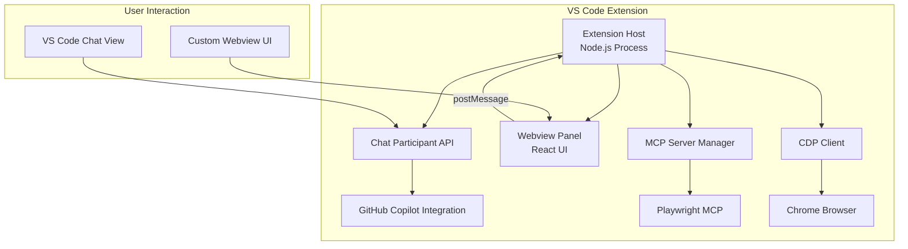

# VS Code Extension Migration - Deep Dive Analysis & Plan

## Executive Summary

This document provides a comprehensive analysis of migrating the JARVIS AI Electron application to a VS Code extension. The migration is **technically feasible** but involves **significant architectural changes** due to fundamental differences between Electron and VS Code extension environments.

> [!IMPORTANT]
> This is a **research and planning document only**. No code changes are being made.

---

## Current Architecture Analysis

### Monorepo Structure

```
jarvis-ai/
├── packages/
│   ├── core/          # Shared logic (reusable in VS Code extension ✅)
│   ├── cli/           # Terminal interface (not applicable ❌)
│   └── desktop/       # Electron app (needs replacement 🔄)
```

### Key Components Analyzed

| Component | Files | Lines | Complexity | Migration Effort |
|-----------|-------|-------|------------|------------------|
| Main Process | `main/index.ts` | ~1900 | High | 🔴 Major rewrite |
| Preload Bridge | `preload.ts` | 425 | Medium | 🟡 Replace with message passing |
| React UI | 19 components | ~3500 | Medium | 🟡 Adapt to webview |
| Core Library | 10 modules | ~3000 | Low | 🟢 Mostly reusable |
| CDP/Recording | 5 files | ~1200 | High | 🔴 Complex adaptation |

---

## Electron vs VS Code Extension Capabilities

### What Electron Has (Current App)

| Capability | Usage in JARVIS AI | VS Code Alternative |
|------------|-------------------|---------------------|
| **BrowserWindow** | Main app window | Webview Panel |
| **IPC (ipcMain/ipcRenderer)** | 70+ API calls | Message passing via webview postMessage |
| **contextBridge** | Secure API exposure | webview.postMessage() / onDidReceiveMessage |
| **Native dialogs** | File picker, messages | vscode.window.showOpenDialog, showInputBox |
| **app.getPath()** | userData, home, temp | vscode.ExtensionContext.globalStorageUri |
| **Child process spawning** | MCP servers, Chrome | ✅ Fully supported in extension host |
| **File system access** | Session storage | ✅ Fully supported (vscode.workspace.fs) |
| **Chrome DevTools Protocol** | CDP via WebSocket | ✅ Works from extension host |
| **Screencast recording** | Live execution view | ⚠️ Needs adaptation |

### VS Code Extension Architecture



---

## Migration Feasibility Analysis

### ✅ Fully Compatible Components (Low Effort)

These can be reused with minimal changes:

1. **JarvisClient** (`core/client.ts`)
   - Wraps `@github/copilot-sdk` - works in any Node.js environment
   - Message handling, streaming responses
   - Event-based architecture

2. **Persona System** (`core/personas/`)
   - PersonaManager, persona definitions
   - System prompt builders
   - No Electron dependencies

3. **Gherkin Generation** (`core/gherkin/`)
   - Parser and generator
   - Pure TypeScript logic

4. **Recording Logic** (`core/recording/`)
   - AI enhancer, event processing
   - Locator extraction
   - Replay executor

5. **Configuration** (`core/config/`)
   - YAML-based config
   - Just needs path adjustments for VS Code storage

### 🟡 Requires Adaptation (Medium Effort)

1. **CDP Client** (`core/cdp/client.ts`)
   - WebSocket-based, works in Node.js
   - Chrome launcher needs process spawning (supported)
   - Need to handle path detection differently

2. **Screencast Recorder** (`core/cdp/screencast-recorder.ts`)
   - Captures frames via CDP (works)
   - Video generation needs adaptation
   - Webview can display frames

3. **React UI Components** (19 files)
   - Move to webview context
   - Replace `window.jarvis.*` with message passing
   - Adapt styling for VS Code theming

### 🔴 Requires Significant Rewrite (High Effort)

1. **Main Process → Extension Host**
   - Replace `ipcMain.handle()` with message handlers
   - Integrate with VS Code APIs
   - Handle extension lifecycle

2. **Preload Bridge → Message Passing**
   - Complete rewrite of communication layer
   - No `contextBridge` in webviews

3. **Native Dialogs**
   - Replace Electron dialogs with VS Code equivalents
   - Different API signatures

---

## Two Migration Approaches

### Approach A: Webview-Centric (Preserve Current UI)

This approach keeps the React-based chat interface in a VS Code webview.

**Pros:**
- Preserves existing UI/UX
- React components mostly reusable
- Can show live execution frames
- Full control over layout

**Cons:**
- More complex message passing
- Separate from VS Code's native chat
- User has to learn new UI location

**Architecture:**
```
┌─────────────────────────────────────────────────────────┐
│                    VS Code Extension                     │
├─────────────────────────────────────────────────────────┤
│  Extension Host (Node.js)                               │
│  ├── JarvisCore (reused from @jarvis-ai/core)           │
│  ├── MCP Server Manager (spawn Playwright MCP)          │
│  ├── CDP Client & Chrome Launcher                       │
│  ├── Screencast Recorder                                │
│  └── VS Code API Integration                            │
├─────────────────────────────────────────────────────────┤
│  Webview Panel                                          │
│  ├── React App (adapted from desktop/renderer)          │
│  ├── Message Bridge (replaces preload.ts)               │
│  └── All 19 existing components                         │
└─────────────────────────────────────────────────────────┘
```

### Approach B: Chat Participant (Native VS Code Chat)

This approach integrates with VS Code's built-in Copilot chat.

**Pros:**
- Native VS Code experience
- Users familiar with @mentions
- Less custom UI to maintain
- Better integration with Copilot

**Cons:**
- Limited UI customization
- Live execution view needs separate webview
- Recording panel needs separate UI
- Can't fully replicate current experience

**Architecture:**
```
┌─────────────────────────────────────────────────────────┐
│                    VS Code Extension                     │
├─────────────────────────────────────────────────────────┤
│  Chat Participant (@jarvis)                             │
│  ├── Handle prompts / test instructions                 │
│  ├── Stream responses to chat                           │
│  └── Trigger test execution                             │
├─────────────────────────────────────────────────────────┤
│  Execution Webview (for live view)                      │
│  ├── LiveExecutionLog component                         │
│  ├── Screencast viewer                                  │
│  └── Recording controls                                 │
├─────────────────────────────────────────────────────────┤
│  Extension Host                                         │
│  ├── JarvisCore                                         │
│  ├── MCP/CDP integration                                │
│  └── Recording management                               │
└─────────────────────────────────────────────────────────┘
```

### 📊 Recommendation: Hybrid Approach

Combine both approaches for maximum functionality:

1. **Chat Participant** for quick test execution commands
2. **Webview Panel** for full-featured UI (recording, settings, session history)

---

## Detailed Component Migration Plan

### Phase 1: Extension Foundation (Week 1-2)

#### 1.1 Create Extension Scaffold

```
jarvis-vscode/
├── package.json          # VS Code extension manifest
├── src/
│   ├── extension.ts      # Entry point, activation
│   ├── chat/             # Chat participant
│   ├── webview/          # Webview provider
│   ├── services/         # Core adapters
│   └── types/            # Shared types
├── webview-ui/           # React app (from desktop/renderer)
└── resources/            # Icons, assets
```

#### 1.2 Extension Manifest (`package.json`)

Key capabilities to register:
- `chatParticipants` - @jarvis chat integration
- `webviewProvider` - Panel view
- `commands` - Quick actions
- `configuration` - Settings

### Phase 2: Core Service Adaptation (Week 2-3)

#### 2.1 JarvisClient Wrapper

Adapt for VS Code context storage:

```typescript
// services/jarvis-service.ts
class JarvisService {
  private client: JarvisClient;
  private context: vscode.ExtensionContext;
  
  async initialize(workDir: string, personaId: string) {
    // Use globalStorageUri instead of app.getPath('userData')
    const storagePath = this.context.globalStorageUri.fsPath;
    // ... rest of initialization
  }
}
```

#### 2.2 MCP Server Management

MCP servers can be spawned from extension host:

```typescript
// services/mcp-manager.ts
import { spawn } from 'child_process';

class MCPManager {
  async startPlaywrightMCP(cdpEndpoint?: string): Promise<ChildProcess> {
    // VS Code extensions can spawn child processes
    return spawn('npx', ['@playwright/mcp', ...(cdpEndpoint ? ['--cdp-endpoint', cdpEndpoint] : [])]);
  }
}
```

#### 2.3 Chrome/CDP Integration

Chrome launcher works with process spawning:

```typescript
// services/chrome-service.ts
class ChromeService {
  private launcher: ChromeLauncher;
  
  async launchChrome(headless: boolean = false) {
    // chromeLauncher package works in Node.js
    // Extension host is a Node.js process
    await this.launcher.launch({ headless, port: 9222 });
  }
}
```

### Phase 3: UI Migration (Week 3-4)

#### 3.1 Message Bridge (Replacing preload.ts)

Create type-safe message passing:

```typescript
// webview-ui/lib/vscode-api.ts
interface MessageRequest {
  type: 'sendMessage' | 'startRecording' | 'stopRecording' | ...;
  payload: any;
}

const vscode = acquireVsCodeApi();

export const jarvisAPI = {
  sendMessage: (prompt: string) => {
    return sendRequest({ type: 'sendMessage', payload: { prompt } });
  },
  // ... map all 70+ APIs to message types
};

// Host side handler
webviewPanel.webview.onDidReceiveMessage(async (message) => {
  switch (message.type) {
    case 'sendMessage':
      return await jarvisService.sendMessage(message.payload.prompt);
    // ...
  }
});
```

#### 3.2 Component Adaptations

| Original Component | Changes Needed |
|-------------------|----------------|
| `App.tsx` | Replace `window.jarvis` calls with message API |
| `ChatInterface.tsx` | No changes needed |
| `ActivityLogs.tsx` | No changes needed |
| `LiveExecutionLog.tsx` | No changes needed |
| `RecordingPanel.tsx` | Replace dialog calls |
| `Settings.tsx` | Use VS Code settings API |
| `Header.tsx` | Simplify for webview |
| `PersonaModal.tsx` | May become VS Code quick pick |

### Phase 4: Chat Participant (Week 4-5)

#### 4.1 Register Participant

```typescript
// chat/jarvis-participant.ts
vscode.chat.createChatParticipant('jarvis', async (request, context, stream, token) => {
  // Handle @jarvis prompts
  const persona = request.command === 'test' ? 'manual-test-execution' : 'record-and-repeat';
  
  await jarvisService.sendMessage(request.prompt, {
    onToken: (token) => stream.push(new vscode.ChatResponseMarkdownPart(token)),
    onToolCall: (tool) => stream.push(new vscode.ChatResponseProgressPart(tool.name)),
  });
});
```

#### 4.2 Commands

- `@jarvis test login flow on example.com` - Execute test
- `@jarvis record` - Open recording panel
- `@jarvis replay login.feature` - Replay Gherkin

### Phase 5: Testing & Polish (Week 5-6)

---

## Critical Functionality Preservation

### Feature Parity Checklist

| Feature | Desktop | VS Code Extension | Notes |
|---------|---------|-------------------|-------|
| Manual Test Execution | ✅ | ✅ | Chat + Webview |
| Record and Repeat | ✅ | ✅ | Webview panel |
| Playwright MCP Integration | ✅ | ✅ | Child process |
| Live Execution Frames | ✅ | ⚠️ | Webview only (no native) |
| CDP / Screencast | ✅ | ✅ | Works via WebSocket |
| Session History | ✅ | ✅ | Use globalStorageUri |
| Persona Switching | ✅ | ✅ | VS Code quick pick |
| Gherkin Generation | ✅ | ✅ | Core logic unchanged |
| Gherkin Refinement | ✅ | ✅ | Chat interface |
| Export to File | ✅ | ✅ | workspace.fs API |
| Activity Logs | ✅ | ✅ | Webview panel |
| Model Selection | ✅ | ✅ | VS Code settings |
| Configuration UI | ✅ | ✅ | VS Code settings + webview |
| Folder Picker | ✅ | ✅ | showOpenDialog |
| Native Dialogs | ✅ | ✅ | VS Code equivalents |

### Areas Requiring Extra Attention

> [!CAUTION]
> These features need careful implementation to avoid functionality loss:

1. **Screencast Live View**
   - Currently streams frames via IPC to React
   - In VS Code: Must use webview postMessage (slightly higher latency)
   - Mitigation: Optimize frame batching

2. **Recording Panel State**
   - Electron keeps state in main process
   - VS Code: Must persist in globalState between activations

3. **Chrome Lifecycle**
   - Electron handles cleanup on quit
   - VS Code: Must handle extension deactivation carefully

---

## Effort Estimation

### Development Time

| Phase | Tasks | Estimated Effort |
|-------|-------|------------------|
| Phase 1 | Extension scaffold, basic activation | 2-3 days |
| Phase 2 | Core services adaptation | 4-5 days |
| Phase 3 | UI/Webview migration | 5-7 days |
| Phase 4 | Chat participant | 2-3 days |
| Phase 5 | Testing, polish, docs | 3-4 days |
| **Total** | | **16-22 days** (~3-4 weeks) |

### Risk Assessment

| Risk | Likelihood | Impact | Mitigation |
|------|------------|--------|------------|
| Webview performance | Medium | Medium | Optimize message batching, lazy loading |
| MCP server issues on Windows | Medium | High | Test early on Windows |
| Chat API changes | Low | Medium | Abstract API layer |
| Live frame latency | Medium | Low | Accept slight increase, optimize |

---

## What You Would Lose vs Gain

### Potential Losses (if not carefully handled)

1. **Standalone Installer** - VS Code users only
2. **Dock/Taskbar Icon** - Becomes extension icon
3. **Full Window Control** - Constrained to VS Code panels
4. **macOS-specific UX** - No native titleBar styling

### Gains

1. **IDE Integration** - Access to workspace, files, terminals
2. **Copilot Chat Integration** - Native @jarvis mentions
3. **Cross-platform Consistency** - Same experience everywhere
4. **Easier Distribution** - VS Code Marketplace
5. **Auto-updates** - Via VS Code extension updates
6. **Reduced Maintenance** - No Electron security updates

---

## Conclusion

### Feasibility: ✅ **Highly Feasible**

All critical functionality can be preserved:
- Core logic is 100% reusable
- MCP/CDP works in VS Code extension host
- React UI adapts to webviews
- Native VS Code APIs cover all dialog needs

### Recommended Next Steps

1. **Decide on primary UI approach** (Webview vs Chat Participant vs Hybrid)
2. **Create extension scaffold** with basic activation
3. **Migrate core services first** (JarvisClient, MCP)
4. **Port one persona end-to-end** as proof of concept
5. **Migrate remaining UI** incrementally

### Questions for Stakeholders

1. Is the webview-only approach acceptable, or is Chat Participant integration required?
2. Should the VS Code extension replace or complement the Electron app?
3. What's the target VS Code version? (Chat API is relatively new)
