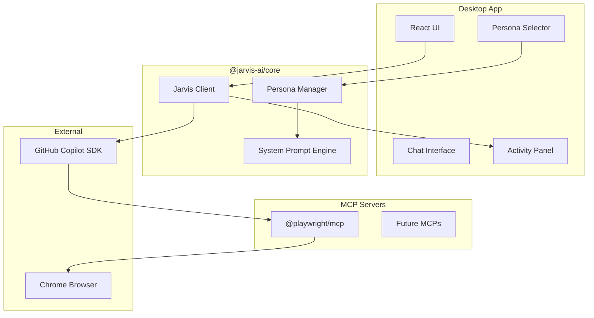
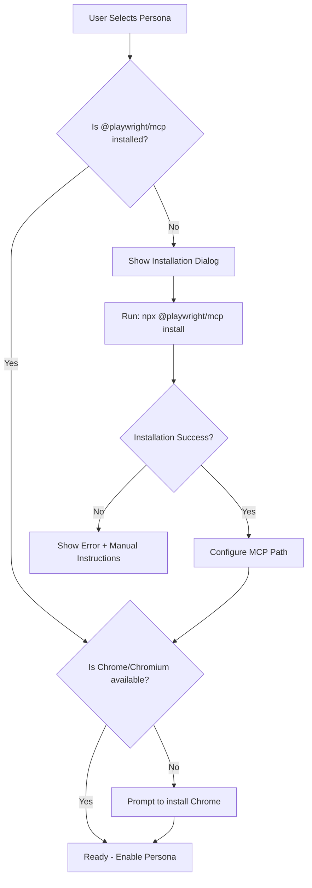

# JARVIS-AI Product Specification

## 1. Overview

JARVIS-AI is a QA Assistant desktop application for Test Engineers that supports multiple testing personas. The first persona, **Manual Test Execution**, enables users to execute test cases through natural language or Gherkin format using browser automation.

---

## 2. Architecture

### 2.1 High-Level Architecture



### 2.2 Persona System Architecture

Each persona is defined by:

- **ID**: Unique identifier (e.g., `manual-test-execution`)
- **Name**: Display name
- **Description**: What the persona does
- **Icon**: Visual identifier
- **System Prompt**: AI behavior configuration
- **Required MCPs**: List of MCP servers needed
- **Agent Skills**: Specialized knowledge files

New files to create:

- `packages/core/src/personas/types.ts` - Persona type definitions
- `packages/core/src/personas/manager.ts` - Persona lifecycle management
- `packages/core/src/personas/manual-test-execution/` - First persona implementation

---

## 3. Persona Selection UX

### 3.1 First Launch Experience

When the app launches for the first time (or no persona is selected):

1. Display a full-screen persona selection modal
2. Show available personas as cards with icon, name, and description
3. User must select a persona to proceed
4. Selection is persisted to `~/.jarvis/settings.json`

### 3.2 Persona Switching

After initial selection:

- Current persona shown in the Header component
- Click to open persona switcher dropdown/modal
- Switching personas:
                                                                                                                                - Prompts to save current session
                                                                                                                                - Clears chat context
                                                                                                                                - Loads new system prompt and MCP configuration
                                                                                                                                - Sessions are tagged with persona ID

### 3.3 UI Component Changes

Modify [`packages/desktop/src/renderer/App.tsx`](packages/desktop/src/renderer/App.tsx):

- Add persona state management
- Show PersonaModal when no persona selected

New components:

- `PersonaModal.tsx` - Full-screen selection modal
- `PersonaSwitcher.tsx` - Header dropdown for switching

---

## 4. Manual Test Execution Persona

### 4.1 Capabilities

- Execute test cases from natural language instructions
- Execute test cases from Gherkin/BDD feature files
- Open and control visible Chrome browser
- Report pass/fail with error details in chat
- Show actions and AI reasoning in Activity Panel

### 4.2 System Prompt

Location: `packages/core/src/personas/manual-test-execution/system-prompt.ts`

```markdown
You are JARVIS, a QA Test Execution Assistant. Your role is to execute manual test cases by controlling a web browser using Playwright.

## Your Capabilities
- Navigate to URLs and web applications
- Interact with page elements (click, type, select, hover)
- Verify page content and element states
- Take screenshots when needed
- Report test results clearly

## Test Case Input Formats
You accept test cases in two formats:

### 1. Natural Language Instructions
Example:
"Go to example.com, click the Login button, enter username 'test@email.com' and password 'secret123', click Submit, verify the dashboard is displayed"

### 2. Gherkin/BDD Format
Example:
Feature: User Login
  Scenario: Successful login
    Given I navigate to "https://example.com"
    When I click the "Login" button
    And I enter "test@email.com" in the username field
    And I enter "secret123" in the password field
    And I click the "Submit" button
    Then I should see the dashboard page

## Execution Guidelines
1. Always explain what you're about to do before each action
2. Use robust locators (prefer data-testid, then accessible names, then CSS selectors)
3. Wait for elements to be visible/enabled before interacting
4. If an action fails, explain the error clearly and suggest fixes
5. Report final test result as PASS or FAIL with summary

## Locator Priority (use in this order)
1. data-testid attributes: [data-testid="login-button"]
2. Accessible names: button with text "Login"
3. ARIA labels: [aria-label="Submit form"]
4. Placeholder text for inputs
5. CSS selectors as last resort

## Error Handling
- If element not found: Wait up to 10 seconds, then report with screenshot
- If action fails: Capture current page state and explain what went wrong
- If navigation fails: Check URL and report network issues
```

### 4.3 Agent Skill for Playwright MCP

Location: `packages/core/src/personas/manual-test-execution/SKILL.md`

```markdown
# Playwright Browser Automation Skill

## MCP Server
This persona uses Microsoft's @playwright/mcp server for browser automation.

## Available Tools
- browser_navigate: Navigate to a URL
- browser_click: Click an element
- browser_type: Type text into an element  
- browser_fill: Fill a form field (clears existing content)
- browser_select: Select dropdown option
- browser_hover: Hover over an element
- browser_screenshot: Capture screenshot
- browser_wait: Wait for element or condition
- browser_get_text: Get text content of element
- browser_get_attribute: Get element attribute value

## Best Practices

### Locator Strategies
1. **Prefer semantic locators:**
   - `getByRole('button', { name: 'Submit' })`
   - `getByLabel('Email address')`
   - `getByPlaceholder('Enter your email')`
   - `getByText('Welcome back')`

2. **Use data-testid for dynamic content:**
   - `getByTestId('user-profile-menu')`

3. **Avoid fragile selectors:**
   - Don't use: `.btn-primary`, `#submit-btn`, `div > span:nth-child(2)`
   - These break easily with UI changes

### Waiting Strategies
- Always wait for elements before interacting
- Use `waitForSelector` with appropriate timeout
- Check for loading states before assertions

### Error Recovery
- If click fails, try scrolling element into view
- If element not visible, check for modals/overlays
- If text input fails, verify field is enabled and not readonly

### Assertions
- Verify page title or URL after navigation
- Check for expected text content
- Validate element visibility for UI state
```

---

## 5. Chat Interface UX

### 5.1 Test Case Input

The existing [`InputArea.tsx`](packages/desktop/src/renderer/components/InputArea.tsx) component needs:

- **File attachment button**: Allow attaching `.feature` files
- **Format detection**: Auto-detect Gherkin vs natural language
- **Syntax highlighting**: For Gherkin in input area (optional)

### 5.2 Message Display

During test execution, the [`ChatInterface.tsx`](packages/desktop/src/renderer/components/ChatInterface.tsx) shows:

1. **User message**: The test case input
2. **Assistant response** (streaming):

                                                                                                                                                                                                - "Starting test execution..."
                                                                                                                                                                                                - "Step 1: Navigating to https://example.com" 
                                                                                                                                                                                                - "Step 2: Clicking Login button..."
                                                                                                                                                                                                - Final result: "**TEST PASSED** - All 5 steps completed successfully"
                                                                                                                                                                                                - Or: "**TEST FAILED** - Step 3 failed: Element 'Submit' not found"

### 5.3 Activity Panel

The [`ActivityLogs.tsx`](packages/desktop/src/renderer/components/ActivityLogs.tsx) component displays:

| Event Type | Display |

|------------|---------|

| `tool_start` | "Executing: browser_click('Login button')" with spinner |

| `tool_complete` | "Completed: browser_click" with checkmark |

| `reasoning_delta` | AI's thinking about next step |

| `error` | Red error message with details |

Current implementation already supports this - just needs styling refinement for browser actions.

---

## 6. Playwright MCP Integration

### 6.1 MCP Server Configuration

Package: `@playwright/mcp` (Microsoft official)

Installation location: Managed by JARVIS, stored in app data directory.

### 6.2 Auto-Installation Flow

When user selects Manual Test Execution persona:



### 6.3 Implementation Details

New file: `packages/core/src/mcp/playwright-manager.ts`

```typescript
interface PlaywrightMCPManager {
  isInstalled(): Promise<boolean>;
  install(): Promise<void>;
  getServerPath(): string;
  startServer(): Promise<MCPServer>;
  stopServer(): Promise<void>;
}
```

MCP configuration is passed to Copilot SDK session creation. Modify [`packages/core/src/client.ts`](packages/core/src/client.ts) to:

- Accept MCP server configuration from persona
- Start MCP servers before creating Copilot session
- Pass MCP endpoint to Copilot SDK

---

## 7. Session Management

### 7.1 Session Tagging

Modify session storage in [`packages/desktop/src/main/index.ts`](packages/desktop/src/main/index.ts):

```typescript
interface Session {
  id: string;
  title: string;
  personaId: string;  // NEW: Tag session with persona
  messages: Message[];
  createdAt: string;
  updatedAt: string;
}
```

### 7.2 Persona-Filtered Sessions

- SessionSidebar shows only sessions for current persona
- Option to view all sessions with persona badge

---

## 8. Future Persona Extensibility

### 8.1 Planned Personas

1. **Exploratory Testing**: Free-form testing with AI suggestions
2. **Record and Play**: Record browser actions, generate replayable scripts

### 8.2 Persona Plugin Architecture

Each persona is a self-contained module:

```
packages/core/src/personas/
├── types.ts           # Shared types
├── manager.ts         # Persona registry and lifecycle
├── manual-test-execution/
│   ├── index.ts       # Persona definition
│   ├── system-prompt.ts
│   ├── SKILL.md
│   └── mcp-config.ts
├── exploratory-testing/  # Future
└── record-and-play/      # Future
```

---

## 9. File Changes Summary

### New Files

- `packages/core/src/personas/types.ts`
- `packages/core/src/personas/manager.ts`
- `packages/core/src/personas/manual-test-execution/index.ts`
- `packages/core/src/personas/manual-test-execution/system-prompt.ts`
- `packages/core/src/personas/manual-test-execution/SKILL.md`
- `packages/core/src/personas/manual-test-execution/mcp-config.ts`
- `packages/core/src/mcp/playwright-manager.ts`
- `packages/desktop/src/renderer/components/PersonaModal.tsx`
- `packages/desktop/src/renderer/components/PersonaSwitcher.tsx`

### Modified Files

- [`packages/core/src/client.ts`](packages/core/src/client.ts) - Add persona/MCP support
- [`packages/core/src/types.ts`](packages/core/src/types.ts) - Add persona types
- [`packages/desktop/src/main/index.ts`](packages/desktop/src/main/index.ts) - Session tagging, MCP lifecycle
- [`packages/desktop/src/renderer/App.tsx`](packages/desktop/src/renderer/App.tsx) - Persona state
- [`packages/desktop/src/renderer/components/Header.tsx`](packages/desktop/src/renderer/components/Header.tsx) - Persona switcher
- [`packages/desktop/src/renderer/components/InputArea.tsx`](packages/desktop/src/renderer/components/InputArea.tsx) - File attachment
- [`packages/desktop/src/renderer/components/SessionSidebar.tsx`](packages/desktop/src/renderer/components/SessionSidebar.tsx) - Persona filtering

---

## 10. Success Criteria

1. User can select Manual Test Execution persona on app launch
2. Playwright MCP auto-installs if not present
3. User can paste test cases (English or Gherkin) and see them execute in visible Chrome
4. Activity Panel shows real-time actions and AI reasoning
5. Test results (pass/fail) displayed clearly in chat
6. Sessions are saved and tagged with persona