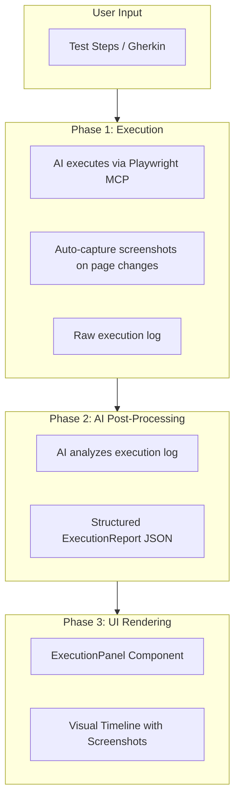

# Manual Test Execution UX Revamp

## Current Problems

- Execution report steps are 1:1 with Playwright tool calls (shows "playwright-run code" instead of meaningful steps)
- No screenshots visible despite AI mentioning them
- No clear indication of execution progress/state to the user
- Report appears abruptly without context

## New Architecture



## Key Changes

### 1. New Execution States and UI Flow

Create distinct execution phases with appropriate UI for each:

| State | UI Display |

|-------|------------|

| `idle` | Welcome screen with instructions |

| `executing` | Full-width execution panel with animated progress, live status updates |

| `processing` | Processing overlay (like RecordingPanel) - "AI is analyzing results..." |

| `completed` | Execution report with pass/fail badge, steps timeline, screenshots |

| `error` | Error state with retry option |

### 2. New ExecutionPanel Component

Replace the current chat-based approach with a dedicated execution panel (similar to RecordingPanel):

**File: [`packages/desktop/src/renderer/components/ExecutionPanel.tsx`](packages/desktop/src/renderer/components/ExecutionPanel.tsx)**

```
+----------------------------------------------------------+
|  [Test Execution]                          [Cancel]       |
+----------------------------------------------------------+
|                                                          |
|  When idle:                                              |
|  - Show test input form (textarea or file upload)        |
|  - "Run Test" button                                     |
|                                                          |
|  When executing:                                         |
|  - Animated progress indicator (pulsing circles)         |
|  - Current action text: "Navigating to saucedemo.com..." |
|  - Live browser activity feed (collapsible)              |
|  - Elapsed time counter                                  |
|                                                          |
|  When processing:                                        |
|  - ProcessingOverlay component (reuse from RecordingPanel)|
|  - "AI is analyzing test results..."                     |
|                                                          |
|  When completed:                                         |
|  - ExecutionReport component (enhanced version)          |
|  - "Run Again" / "New Test" buttons                      |
|                                                          |
+----------------------------------------------------------+
```

### 3. AI Post-Processing Service

Create a service that takes raw execution data and produces a structured report:

**File: [`packages/core/src/execution-report/ai-processor.ts`](packages/core/src/execution-report/ai-processor.ts)**

```typescript
interface RawExecutionData {
  testInput: string;           // Original user test steps
  toolCalls: ToolCallRecord[]; // All Playwright tool calls
  messages: MessageRecord[];   // All AI messages
  screenshots: Screenshot[];   // Captured screenshots with metadata
  duration: number;
  finalStatus: "passed" | "failed";
}

interface ProcessedExecutionReport {
  id: string;
  testName: string;
  status: "passed" | "failed";
  duration: number;
  steps: ProcessedStep[];
  summary: string;
}

interface ProcessedStep {
  id: string;
  name: string;           // Human-readable: "Navigate to login page"
  description: string;    // Details: "Opened https://saucedemo.com"
  status: "passed" | "failed" | "skipped";
  screenshot?: string;    // Base64 or path to screenshot
  error?: string;
  duration?: number;
}
```

The AI processor will:

1. Take raw tool calls and messages
2. Use AI to group and describe steps meaningfully
3. Match screenshots to appropriate steps
4. Determine per-step pass/fail status
5. Generate a human-readable summary

### 4. Screenshot Capture Strategy

Modify the system prompt and add automatic screenshot capture:

**Approach A - AI-Driven (Recommended):**

- Update system prompt to instruct AI to take `browser_screenshot` after each page transition
- Parse screenshot results from tool call responses
- Store screenshots in temp directory with metadata

**Approach B - CDP-Based (Alternative):**

- Use CDP client to listen for page navigation events
- Auto-capture screenshots on `Page.frameNavigated` events
- Requires running CDP alongside Playwright MCP

We will use **Approach A** initially as it requires fewer changes and leverages the existing Playwright MCP.

### 5. Enhanced Execution Report Component

**File: [`packages/desktop/src/renderer/components/ExecutionReport.tsx`](packages/desktop/src/renderer/components/ExecutionReport.tsx)**

Redesign with:

- Prominent pass/fail header with test name and duration
- Vertical timeline with screenshot thumbnails
- Each step shows: number, name, status icon, duration
- Screenshot gallery with lightbox
- Expandable error details for failed steps
- Export/share button

### 6. State Management Hook

**File: [`packages/desktop/src/renderer/hooks/useTestExecution.ts`](packages/desktop/src/renderer/hooks/useTestExecution.ts)**

```typescript
interface TestExecutionState {
  status: "idle" | "executing" | "processing" | "completed" | "error";
  currentAction: string;      // Live status text
  elapsedTime: number;
  rawData: RawExecutionData | null;
  report: ProcessedExecutionReport | null;
  error: string | null;
}

interface UseTestExecutionReturn {
  state: TestExecutionState;
  runTest: (testSteps: string) => Promise<void>;
  cancelExecution: () => void;
  reset: () => void;
}
```

## Implementation Files

| File | Action | Purpose |

|------|--------|---------|

| `packages/core/src/execution-report/ai-processor.ts` | Create | AI post-processing service |

| `packages/core/src/execution-report/types.ts` | Modify | Add new interfaces for raw/processed data |

| `packages/desktop/src/renderer/components/ExecutionPanel.tsx` | Create | Main container component with state-based UI |

| `packages/desktop/src/renderer/components/ExecutionProgress.tsx` | Create | Animated progress indicator during execution |

| `packages/desktop/src/renderer/components/ExecutionReport.tsx` | Rewrite | Enhanced report with screenshots |

| `packages/desktop/src/renderer/hooks/useTestExecution.ts` | Create | Comprehensive state management |

| `packages/desktop/src/renderer/components/ChatInterface.tsx` | Modify | Use ExecutionPanel for manual-test-execution |

| `packages/desktop/src/main/index.ts` | Modify | Add IPC for AI post-processing |

| `packages/core/src/personas/manual-test-execution/system-prompt.ts` | Modify | Better screenshot instructions |

## UI Mockup - Execution In Progress

```
+------------------------------------------------------------------+
|                                                                  |
|     [====== Animated Progress Ring ======]                       |
|                                                                  |
|           Executing Test...                                      |
|                                                                  |
|     Current Step: Filling login credentials                      |
|                                                                  |
|     Elapsed: 00:12                                               |
|                                                                  |
|     +-------------------------------------------------------+    |
|     | Live Activity (collapsed)                    [expand] |    |
|     +-------------------------------------------------------+    |
|                                                                  |
|                    [ Cancel Execution ]                          |
|                                                                  |
+------------------------------------------------------------------+
```

## UI Mockup - Completed Report

```
+------------------------------------------------------------------+
|  [PASSED] Login Test                              Duration: 8.2s |
+------------------------------------------------------------------+
|                                                                  |
|  Summary: Successfully logged in and verified products page.     |
|                                                                  |
|  +------------------------------------------------------------+  |
|  |  1. [check] Navigate to login page              0.8s       |  |
|  |      https://www.saucedemo.com/                            |  |
|  |      [thumbnail screenshot]                                 |  |
|  +------------------------------------------------------------+  |
|  |  2. [check] Enter credentials                   0.3s       |  |
|  |      Filled username and password fields                   |  |
|  +------------------------------------------------------------+  |
|  |  3. [check] Submit login form                   0.5s       |  |
|  |      Clicked the Login button                              |  |
|  |      [thumbnail screenshot]                                 |  |
|  +------------------------------------------------------------+  |
|  |  4. [check] Verify products page                0.2s       |  |
|  |      Confirmed page title "Products"                       |  |
|  |      [thumbnail screenshot]                                 |  |
|  +------------------------------------------------------------+  |
|                                                                  |
|          [ Run Again ]    [ New Test ]    [ Export ]             |
|                                                                  |
+------------------------------------------------------------------+
```

## Migration Notes

- Delete the current `ExecutionReportTracker` class (no longer needed)
- The new approach collects raw data during execution and processes it AFTER completion
- Screenshots are captured by AI during execution, not by tracking tool calls
- The UI now has dedicated states instead of mixing with chat messages