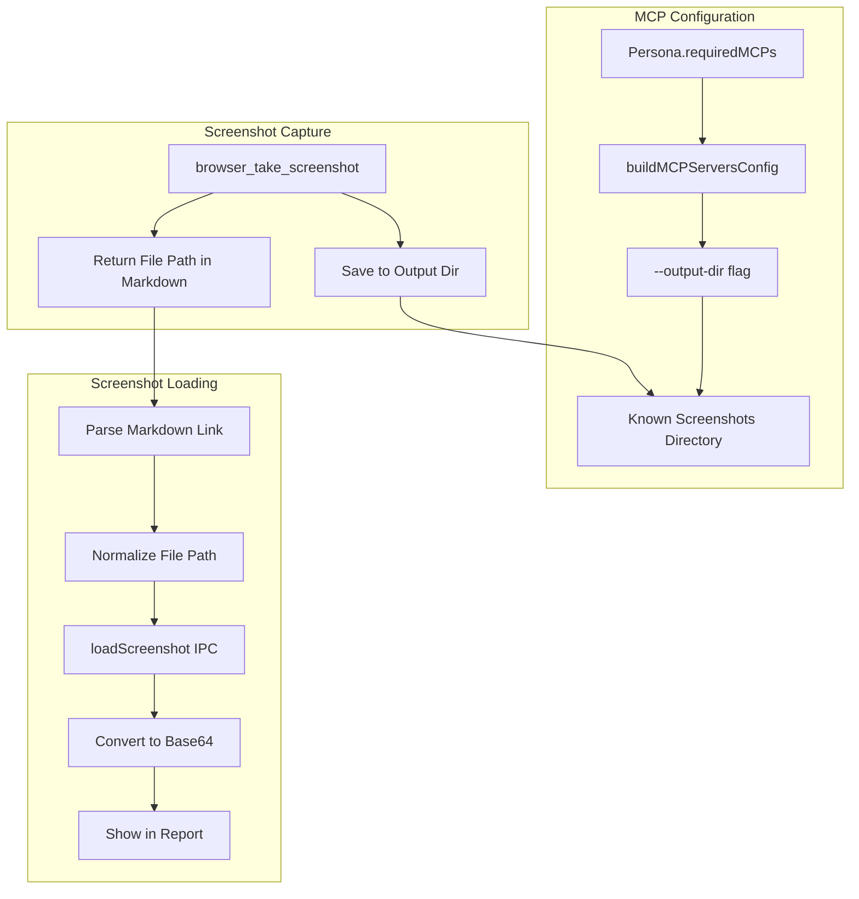

# MCP Architecture Improvements and Screenshot Fix

## Summary

Two main improvements:

1. Replace hardcoded persona checks with dynamic `requiredMCPs` config
2. Fix screenshot capture by configuring a known output directory for Playwright MCP

---

## Task 1: Refactor MCP Server Configuration

**File**: [packages/desktop/src/main/index.ts](packages/desktop/src/main/index.ts)

**Current Problem**: Hardcoded persona ID check

**Solution**: Create helper function using `persona.requiredMCPs`:

```typescript
import { app } from "electron";
import path from "path";

// Get a consistent screenshots directory
function getScreenshotsDir(): string {
  return path.join(app.getPath("userData"), "playwright-screenshots");
}

// Helper function to build MCP servers config from persona
function buildMCPServersConfig(requiredMCPs: MCPServerConfig[]): Record<string, any> {
  const mcpServers: Record<string, any> = {};
  const screenshotsDir = getScreenshotsDir();
  
  for (const mcp of requiredMCPs) {
    const config: any = {
      type: "local",
      command: mcp.command,
      args: [...(mcp.args || [])],
      env: mcp.env || {},
      tools: ["*"],
    };
    
    // For Playwright MCP, add --output-dir for screenshots
    if (mcp.packageName === "@playwright/mcp") {
      config.args.push("--output-dir", screenshotsDir);
    }
    
    mcpServers[mcp.id] = config;
  }
  
  return mcpServers;
}

// Usage
if (selectedPersona?.requiredMCPs && selectedPersona.requiredMCPs.length > 0) {
  mcpServers = buildMCPServersConfig(selectedPersona.requiredMCPs);
}
```

---

## Task 2: Generic MCP Descriptions

**File**: [packages/core/src/personas/manual-test-execution/system-prompt.ts](packages/core/src/personas/manual-test-execution/system-prompt.ts)

Replace hardcoded descriptions with generic pattern:

```typescript
function getMCPServerDescription(packageName: string): string {
  const shortName = packageName
    .split('/').pop()
    ?.replace(/^mcp-?/, '')
    .replace(/-/g, ' ') || packageName;
  return `Provides tools and capabilities via the ${shortName} MCP server. Discover available tools at runtime.`;
}
```

---

## Task 3: Configure Screenshot Directory

**Key Insight from Research**: Playwright MCP supports `--output-dir` flag to specify where screenshots are saved.

**Current MCP args**:

```typescript
args: ["@playwright/mcp"]
```

**Updated MCP args**:

```typescript
args: ["@playwright/mcp", "--output-dir", screenshotsDir]
```

Where `screenshotsDir` is a known location like:

- `app.getPath("userData")/playwright-screenshots` (Electron user data)
- Or `workDir/.jarvis/screenshots` (project-specific)

This ensures we always know where screenshots are saved.

---

## Task 4: Parse and Load Screenshot Files

**File**: [packages/desktop/src/renderer/hooks/useTestExecution.ts](packages/desktop/src/renderer/hooks/useTestExecution.ts)

**The Problem**: Playwright MCP returns file paths in markdown format:

```
### Result
- [Screenshot of full page](../../../../../tmp/playwright-mcp-output/.../screenshot.png)
```

**Solution**: Parse the markdown link and load the file:

```typescript
// After existing base64 checks, add file path detection:

if (!screenshotData && lastCall.result) {
  const resultStr = typeof lastCall.result === 'string' 
    ? lastCall.result 
    : JSON.stringify(lastCall.result);
  
  // Match markdown link with .png file: [text](path/to/file.png)
  const markdownLinkMatch = resultStr.match(/\[.*?\]\(([^)]+\.png)\)/i);
  
  if (markdownLinkMatch) {
    let filePath = markdownLinkMatch[1];
    
    // Normalize the path - handle relative paths with ../
    // The path might be like "../../../tmp/playwright-mcp-output/xxx/file.png"
    // Extract the actual path starting from /tmp/ or the configured output dir
    if (filePath.includes('/tmp/')) {
      filePath = '/tmp' + filePath.split('/tmp')[1];
    } else if (filePath.includes('playwright-screenshots/')) {
      // Handle our configured output directory
      const userDataPath = await window.jarvis.getPath('userData');
      const relativePart = filePath.split('playwright-screenshots/')[1];
      filePath = `${userDataPath}/playwright-screenshots/${relativePart}`;
    }
    
    console.log("[useTestExecution] Screenshot file path:", filePath);
    
    try {
      const base64Data = await window.jarvis.executionReport.loadScreenshot(filePath);
      screenshotData = `data:image/png;base64,${base64Data}`;
      console.log("[useTestExecution] Loaded screenshot from file");
    } catch (e) {
      console.error("[useTestExecution] Failed to load screenshot:", e);
    }
  }
}
```

**Also need**: Add IPC to get Electron paths if not already available:

```typescript
// In main/index.ts
ipcMain.handle("get-path", (_, name: string) => {
  return app.getPath(name as any);
});

// In preload.ts
getPath: (name: string): Promise<string> => ipcRenderer.invoke("get-path", name),
```

---

## Architecture Flow



---

## Files to Modify

| File | Change |

|------|--------|

| `packages/desktop/src/main/index.ts` | Add `buildMCPServersConfig()` with `--output-dir`, add `get-path` IPC |

| `packages/core/src/personas/manual-test-execution/system-prompt.ts` | Replace hardcoded descriptions |

| `packages/desktop/src/renderer/hooks/useTestExecution.ts` | Parse markdown links, normalize paths, load files |

| `packages/desktop/src/preload.ts` | Add `getPath` helper if needed |

---

## Why Previous Attempts Failed

1. **No `--output-dir` configured** - Screenshots went to unpredictable locations
2. **Path normalization issues** - The markdown paths have many `../` prefixes that weren't handled
3. **Missing the actual file read** - Even if path was parsed, the file wasn't being read

---

## Verification

After implementation:

1. Check that `--output-dir` is passed to Playwright MCP args
2. Run a test and verify screenshots are saved to the configured directory
3. Check console logs for "Screenshot file path:" to confirm path parsing
4. Verify screenshots appear in the execution report UI