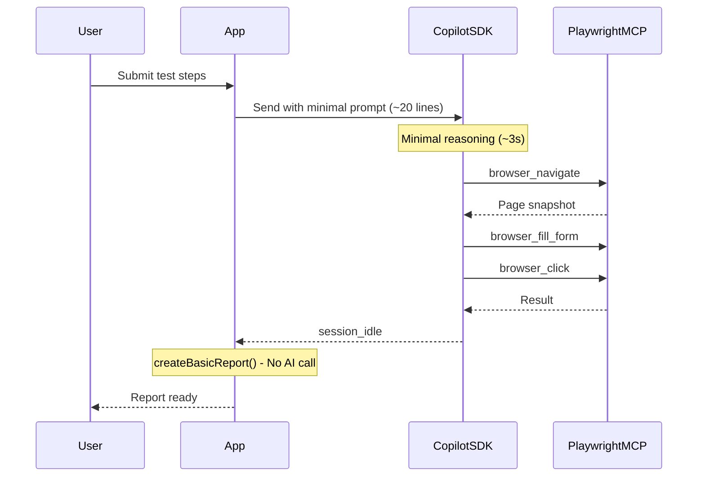

# Optimize Manual Test Execution Speed

## Problem Analysis

Comparing the copilot CLI execution (from your attached log) vs your app:

| Metric | Copilot CLI | Jarvis App |

|--------|-------------|------------|

| Time to first tool call | ~3-4 seconds | ~31 seconds |

| System prompt | Minimal (copilot defaults) | ~194 lines (~4000 tokens) |

| Reasoning output | ~50 words | ~200+ words |

| Post-processing | None | Extra LLM call |

| Total execution | ~20 seconds | Often fails/times out |

**Root Causes:**

1. **Large system prompt** (132 lines + 62 lines SKILL.md) forces extended reasoning
2. **Post-processing AI call** in `processWithAI()` adds unnecessary LLM roundtrip
3. **Verbose instructions** cause the model to over-think before acting

## Solution: Minimal System Prompt + No Post-Processing

### 1. Replace System Prompt with Minimal Version

**File:** [packages/core/src/personas/manual-test-execution/system-prompt.ts](packages/core/src/personas/manual-test-execution/system-prompt.ts)

Replace the 132-line prompt with a minimal ~20 line version:

```typescript
export const MANUAL_TEST_EXECUTION_SYSTEM_PROMPT_TEMPLATE = `You are a QA test executor. Execute test steps using the Playwright MCP tools.

## Available Tools
{{MCP_SERVERS_INFO}}

## Rules
- Execute actions one at a time
- Take a screenshot after navigation and at test completion
- Report PASS or FAIL with brief summary

Execute the test now.`;
```

**Why this works:** The copilot CLI log shows Claude executes effectively with minimal instructions. The model already knows how to use Playwright tools - excessive instructions cause over-thinking.

### 2. Disable Post-Processing AI Call

**File:** [packages/desktop/src/renderer/hooks/useTestExecution.ts](packages/desktop/src/renderer/hooks/useTestExecution.ts) (lines 136-168)

Change the `processResults` function to skip AI processing and use the fallback report directly:

```typescript
// Before: const report = await window.jarvis.executionReport.processWithAI(rawData);
// After: Use createBasicReport directly without AI call
const report = createBasicReport(rawData);
```

This eliminates an entire LLM roundtrip. The `createBasicReport` function already exists in [packages/core/src/execution-report/ai-processor.ts](packages/core/src/execution-report/ai-processor.ts) (lines 184-273) and produces good reports by grouping tool calls into logical steps.

### 3. Remove SKILL.md Loading

**File:** [packages/desktop/src/main/index.ts](packages/desktop/src/main/index.ts) (lines 283-290)

Remove or skip the agent skill loading for this persona:

```typescript
// Skip loading SKILL.md - it's redundant with the minimal prompt
// The 62 lines of skill content add unnecessary token overhead
```

### 4. Simplified Screenshot Strategy

Instead of mandatory screenshot rules, the minimal prompt just says "Take a screenshot after navigation and at test completion". The Playwright MCP already returns page snapshots after each action, so explicit screenshots are only needed for the final report visualization.

## File Changes Summary

| File | Change |

|------|--------|

| `packages/core/src/personas/manual-test-execution/system-prompt.ts` | Replace 132-line prompt with ~20 lines |

| `packages/desktop/src/renderer/hooks/useTestExecution.ts` | Use `createBasicReport()` instead of `processWithAI()` |

| `packages/desktop/src/main/index.ts` | Skip loading SKILL.md for this persona |

| `packages/core/src/personas/manual-test-execution/SKILL.md` | Can be deleted or kept for reference |

## Expected Results

- **Time to first tool:** ~3-5 seconds (vs 31 seconds)
- **Token usage:** ~500 tokens (vs ~4000+ tokens)
- **Total execution:** ~15-25 seconds for simple tests (vs timeouts)
- **Reliability:** No more 400 errors from excessive context

## Architecture Flow (Simplified)



## Comparison: Before vs After

**Before (slow):**

```
User prompt → Large system prompt (4000 tokens) → Extended reasoning (31s) → Tool calls → session_idle → AI post-processing (another LLM call) → Report
```

**After (fast):**

```
User prompt → Minimal prompt (500 tokens) → Quick reasoning (3s) → Tool calls → session_idle → createBasicReport() → Report
```