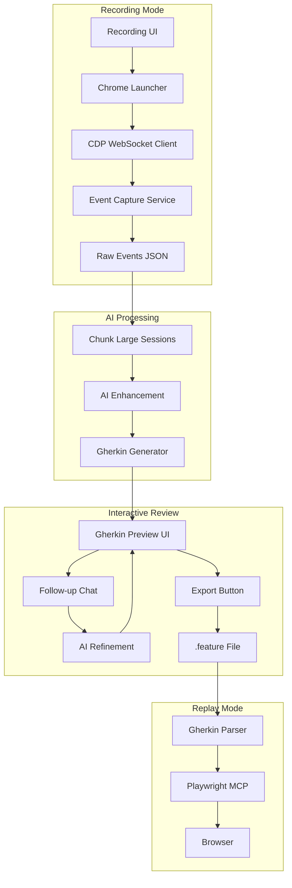
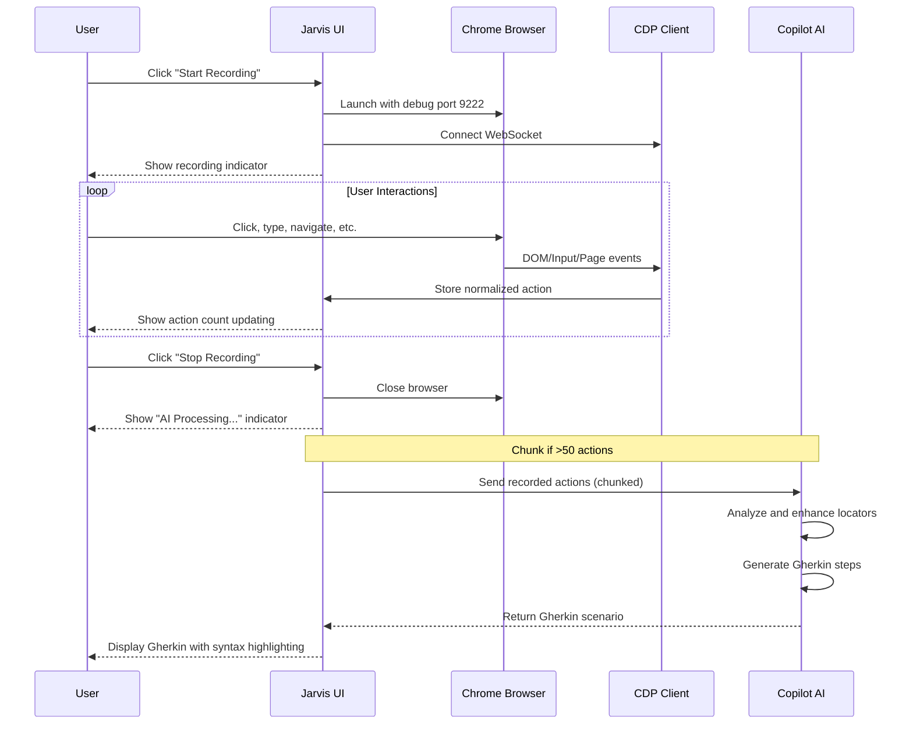
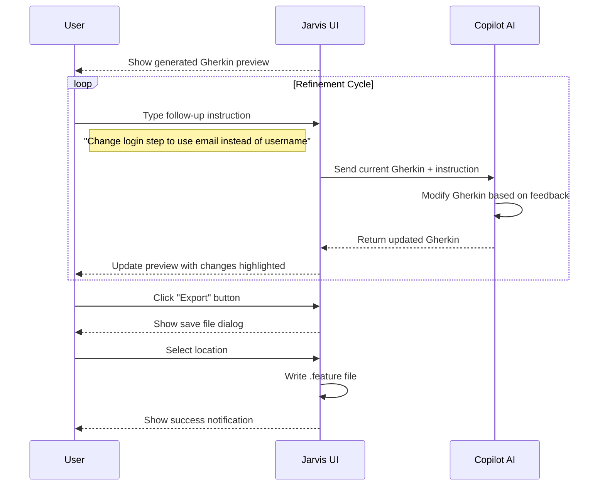
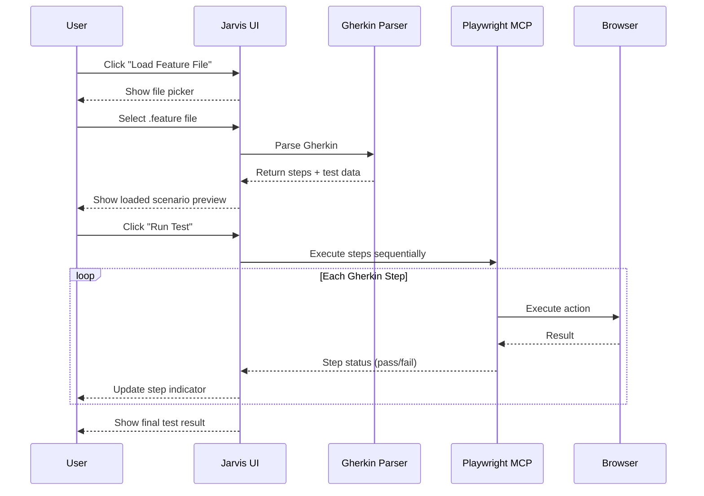
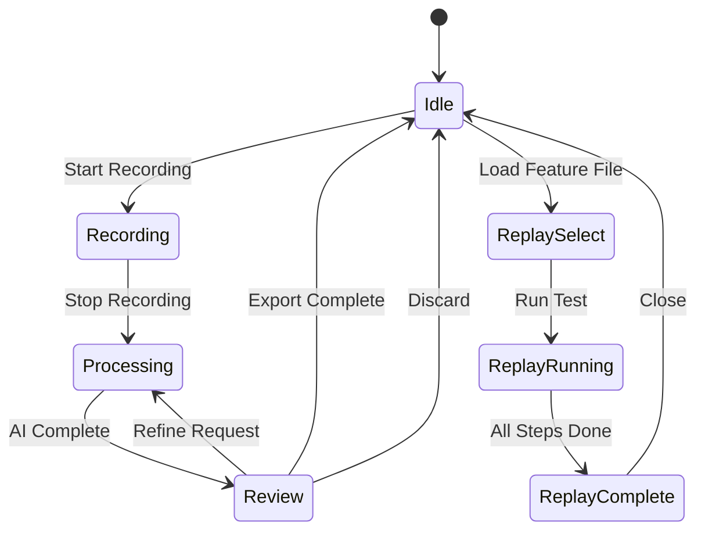

# Record and Repeat Persona Implementation Plan

## Architecture Overview



## Key Design Decisions

- **Recording**: Direct CDP via WebSocket on port 9222 with configurable capture modes
- **Recording Modes**: Two modes - Standard (default, essential only) and Detailed (everything)
- **AI Processing**: Chunk large recordings before sending to AI, show processing indicator
- **Interactive Review**: Display generated Gherkin in UI with syntax highlighting, allow iterative refinement via chat
- **Export**: User explicitly exports to file system only when satisfied
- **Replay**: Existing Playwright MCP (reliable, already integrated)
- **Output**: Standard Gherkin `.feature` files with Scenario Outline and Examples table for test data
- **Locators**: AI-enhanced - capture multiple locator strategies, AI selects best

---

## Recording Mode Configuration

To manage data overhead and recording size, the app supports two recording modes:

### Mode Comparison

| Event Type | Standard Mode (Default) | Detailed Mode |

|------------|------------------------|---------------|

| Clicks | Yes | Yes |

| Typing/Input | Yes | Yes |

| Navigation | Yes | Yes |

| Form Submissions | Yes | Yes |

| Scrolls | Significant only* | All |

| Hovers | No | Yes |

| Focus/Blur | No | Yes |

| Mouse Movement | No | Yes |

| Network Requests | No | Yes |

*Significant scrolls = scroll events that precede an interaction (e.g., scroll to bring element into view before clicking)

### Recording Mode Types

```typescript
type RecordingMode = 'standard' | 'detailed';

interface RecordingModeConfig {
  mode: RecordingMode;
  captureClicks: boolean;
  captureTyping: boolean;
  captureNavigation: boolean;
  captureFormSubmissions: boolean;
  captureScrolls: 'none' | 'significant' | 'all';
  captureHovers: boolean;
  captureFocusBlur: boolean;
  captureMouseMovement: boolean;
  captureNetworkRequests: boolean;
}

const STANDARD_MODE: RecordingModeConfig = {
  mode: 'standard',
  captureClicks: true,
  captureTyping: true,
  captureNavigation: true,
  captureFormSubmissions: true,
  captureScrolls: 'significant',
  captureHovers: false,
  captureFocusBlur: false,
  captureMouseMovement: false,
  captureNetworkRequests: false,
};

const DETAILED_MODE: RecordingModeConfig = {
  mode: 'detailed',
  captureClicks: true,
  captureTyping: true,
  captureNavigation: true,
  captureFormSubmissions: true,
  captureScrolls: 'all',
  captureHovers: true,
  captureFocusBlur: true,
  captureMouseMovement: true,
  captureNetworkRequests: true,
};
```

### When to Use Each Mode

**Standard Mode (Recommended for most cases):**

- Typical user flow recording (login, checkout, form filling)
- Shorter recordings with cleaner data
- Faster AI processing due to smaller data size
- Generates more focused Gherkin scenarios

**Detailed Mode (For complex scenarios):**

- Debugging flaky tests (need to see all interactions)
- Recording hover-triggered UI (tooltips, dropdown menus)
- Capturing network timing for performance tests
- When you need complete interaction history

### Estimated Data Size

| Session Length | Standard Mode | Detailed Mode |

|----------------|---------------|---------------|

| 1 minute | ~5-10 KB | ~50-100 KB |

| 5 minutes | ~25-50 KB | ~250-500 KB |

| 15 minutes | ~75-150 KB | ~750 KB - 1.5 MB |

### UI for Mode Selection

Mode is selected before starting a recording via a dropdown or toggle in the recording controls:

```
┌─────────────────────────────────────────────────┐
│  Recording Mode: [Standard ▼]  [Start Recording]│
│                                                 │
│  ○ Standard - Essential interactions only       │
│  ○ Detailed - Capture everything                │
└─────────────────────────────────────────────────┘
```

## New Dependencies

Add to [`packages/core/package.json`](packages/core/package.json):

```json
{
  "chrome-launcher": "^1.1.0",
  "ws": "^8.16.0",
  "@types/ws": "^8.5.10"
}
```

Add to [`packages/desktop/package.json`](packages/desktop/package.json):

```json
{
  "prism-react-renderer": "^2.3.1"
}
```

---

## User Workflow Diagrams

### Recording Workflow (End-to-End)



### Iterative Refinement Workflow



### Replay Workflow



---

## Implementation Tasks

### 1. CDP Infrastructure (`packages/core/src/cdp/`)

**Files to create:**

- `packages/core/src/cdp/types.ts` - CDP event types and domain interfaces
- `packages/core/src/cdp/client.ts` - WebSocket client for CDP communication
- `packages/core/src/cdp/chrome-launcher.ts` - Launch Chrome with `--remote-debugging-port=9222`

**Key functionality:**

- Connect to `ws://localhost:9222/devtools/page/{targetId}`
- Enable CDP domains: `Page`, `DOM`, `Input`, `Network`, `Runtime`
- Handle CDP messages (request/response pattern with `id` matching)

### 2. Recording Service (`packages/core/src/recording/`)

**Files to create:**

- `packages/core/src/recording/types.ts` - Recording session types, captured action interfaces, mode config
- `packages/core/src/recording/recorder.ts` - Main recorder class with mode-aware filtering
- `packages/core/src/recording/event-processor.ts` - Process CDP events into normalized actions
- `packages/core/src/recording/event-filter.ts` - Filter events based on recording mode
- `packages/core/src/recording/locator-extractor.ts` - Extract multiple locator strategies for elements

**Mode-aware Event Filtering:**

```typescript
class EventFilter {
  constructor(private config: RecordingModeConfig) {}
  
  shouldCapture(event: CDPEvent): boolean {
    switch (event.type) {
      case 'click':
      case 'input':
      case 'navigation':
      case 'submit':
        return true; // Always capture in both modes
        
      case 'scroll':
        if (this.config.captureScrolls === 'none') return false;
        if (this.config.captureScrolls === 'all') return true;
        // 'significant' - only capture if followed by interaction within 500ms
        return this.isSignificantScroll(event);
        
      case 'hover':
        return this.config.captureHovers;
        
      case 'focus':
      case 'blur':
        return this.config.captureFocusBlur;
        
      case 'mousemove':
        return this.config.captureMouseMovement;
        
      default:
        return false;
    }
  }
  
  private isSignificantScroll(scrollEvent: CDPEvent): boolean {
    // Check if this scroll precedes an interaction (click, type) within 500ms
    // Implementation tracks pending scrolls and confirms on next interaction
  }
}
```

**Captured action structure:**

```typescript
interface RecordedAction {
  type: 'click' | 'type' | 'navigate' | 'scroll' | 'hover' | 'submit' | 'focus' | 'blur';
  timestamp: number;
  target: {
    locators: LocatorSet;  // Multiple strategies
    tagName: string;
    textContent?: string;
    attributes: Record<string, string>;
  };
  value?: string;  // For type/input actions
  url?: string;    // For navigation
  screenshot?: string;  // Base64 screenshot at action time
}

interface LocatorSet {
  css: string;
  xpath: string;
  testId?: string;
  text?: string;
  role?: string;
}
```

### 3. Gherkin Generator (`packages/core/src/gherkin/`)

**Files to create:**

- `packages/core/src/gherkin/types.ts` - Gherkin AST types
- `packages/core/src/gherkin/generator.ts` - Convert recorded actions to Gherkin
- `packages/core/src/gherkin/parser.ts` - Parse Gherkin for replay (use `@cucumber/gherkin-utils`)

**Output format example:**

```gherkin
Feature: User Login Flow
  As a user I want to login to access my dashboard

  Scenario Outline: Login with valid credentials
    Given I am on the login page "https://example.com/login"
    When I enter "<username>" into the username field
    And I enter "<password>" into the password field  
    And I click the login button
    Then I should see the dashboard

    Examples:
      | username | password |
      | testuser | Pass123! |
```

### 4. AI Enhancement Service (`packages/core/src/recording/ai-enhancer.ts`)

**Responsibilities:**

- Review raw recorded actions
- Select best locator from captured strategies
- Generate human-readable step descriptions
- Identify logical test boundaries (Given/When/Then)
- Extract test data into Examples table
- Handle iterative refinement based on user feedback

**Chunking Strategy for Large Recordings:**

```typescript
const MAX_ACTIONS_PER_CHUNK = 50;
const MAX_TOKENS_ESTIMATE_PER_ACTION = 150;

interface ChunkedSession {
  chunks: RecordedAction[][];
  totalActions: number;
  chunkCount: number;
}

function chunkRecordedActions(actions: RecordedAction[]): ChunkedSession {
  // Split by natural boundaries (page navigations) when possible
  // Otherwise split by MAX_ACTIONS_PER_CHUNK
  // Each chunk processed separately, then merged by AI
}
```

**Multi-pass Processing for Large Sessions:**

1. **Pass 1 (per chunk)**: Generate Gherkin steps for each chunk independently
2. **Pass 2 (merge)**: AI reviews all chunk results, merges into cohesive scenario
3. **Pass 3 (polish)**: Final review for consistency, deduplication, and readability

**Refinement API:**

```typescript
class AIEnhancer {
  // Initial generation from recorded session
  async generateGherkin(session: RecordedSession): Promise<GherkinResult>;
  
  // Iterative refinement based on user feedback
  async refineGherkin(currentGherkin: string, instruction: string): Promise<GherkinResult>;
  
  // Merge chunks for large recordings
  async mergeChunks(chunks: GherkinResult[]): Promise<GherkinResult>;
}

interface GherkinResult {
  gherkin: string;           // The generated/refined Gherkin text
  summary: string;           // Brief description of what was generated/changed
  suggestions?: string[];    // Optional suggestions for further refinement
}
```

**Integration:** Uses existing `JarvisClient` with a specialized system prompt for recording analysis.

### 5. Record and Repeat Persona (`packages/core/src/personas/record-and-repeat/`)

**Files to create (following existing pattern):**

- `index.ts` - Persona definition
- `system-prompt.ts` - AI behavior for this persona (detailed below)
- `mcp-config.ts` - Playwright MCP config (same as manual-test-execution)
- `SKILL.md` - Agent skill documentation (detailed below)
- `exports.ts` - Re-exports

**Persona definition:**

```typescript
export const RECORD_AND_REPEAT_PERSONA: Persona = {
  id: "record-and-repeat",
  name: "Record and Repeat",
  description: "Record browser interactions and replay them as automated tests. Review and refine generated Gherkin scenarios through conversation.",
  icon: "🔴",
  systemPrompt: RECORD_AND_REPEAT_SYSTEM_PROMPT,
  requiredMCPs: [PLAYWRIGHT_MCP_CONFIG],
  skillPath: path.join(__dirname, "SKILL.md"),
  enabled: true,
};
```

**System Prompt (`system-prompt.ts`) - Key Sections:**

```typescript
export const RECORD_AND_REPEAT_SYSTEM_PROMPT = `
You are a QA automation expert specializing in converting browser recordings into well-structured Gherkin feature files.

## Your Responsibilities

### When Processing Recorded Actions:
1. Analyze the sequence of user interactions
2. Identify the business flow being tested (login, checkout, search, etc.)
3. Group related actions into logical Given/When/Then steps
4. Select the most reliable locator for each element (prefer data-testid > role > text > css)
5. Extract hardcoded values into Examples table for data-driven testing
6. Write human-readable step descriptions that describe WHAT is being done, not HOW

### When Refining Gherkin Based on User Feedback:
1. Understand the user's intent from their instruction
2. Make targeted changes while preserving the overall structure
3. Explain what you changed and why
4. Suggest additional improvements if you notice issues

### Locator Selection Priority:
1. data-testid, data-test, data-cy attributes (most stable)
2. ARIA roles with accessible names
3. Visible text content (for buttons, links)
4. CSS selectors (as fallback)
5. XPath (only if no other option works)

### Output Format:
Always output valid Gherkin syntax. Use Scenario Outline with Examples for parameterized data.
Include comments for complex locators: # Locator: [css=.submit-btn]
`;
```

**Agent Skill (`SKILL.md`) - Key Sections:**

```markdown
# Record and Repeat Agent Skill

## Overview
This skill helps you convert recorded browser interactions into maintainable Gherkin test scenarios.

## Recording Mode
When the user starts recording:
- A Chrome browser opens in debug mode
- All user interactions are captured (clicks, typing, navigation, etc.)
- Multiple locator strategies are captured for each element

## Processing Mode  
After recording stops:
- Raw actions are analyzed for patterns
- Redundant actions (like multiple keypresses) are consolidated
- Logical test boundaries are identified
- Gherkin scenario is generated

## Refinement Mode
The user can ask for changes like:
- "Change the step description to be more business-focused"
- "Use email field instead of username"
- "Add more test data rows to the Examples table"
- "Split this into two separate scenarios"
- "Add assertions to verify the page loaded correctly"

## Replay Mode
When replaying a feature file:
- Parse Gherkin steps into executable commands
- Use Playwright MCP to execute browser actions
- Report pass/fail status for each step

## Best Practices
- Keep scenarios focused on one business flow
- Use descriptive feature and scenario names
- Avoid implementation details in step descriptions
- Parameterize test data using Examples tables
```

### 6. Desktop App Integration

**Main Process (`packages/desktop/src/main/index.ts`):**

- Register new persona with `PersonaManager`
- Add IPC handlers:
  - `recording:start` - Launch Chrome, connect CDP, begin recording (accepts mode config)
  - `recording:stop` - Stop recording, return raw JSON
  - `recording:generate-gherkin` - Process recording with AI, return Gherkin
  - `recording:refine-gherkin` - Refine Gherkin based on user instruction
  - `recording:export` - Save finalized Gherkin to file
  - `recording:get-status` - Return current recording/processing state
  - `recording:get-modes` - Return available recording modes with descriptions

**Preload (`packages/desktop/src/preload.ts`):**

```typescript
recording: {
  // Mode configuration
  getModes(): Promise<RecordingModeInfo[]>,
  
  // Recording lifecycle (accepts mode)
  start(mode: RecordingMode): Promise<{ targetId: string }>,
  stop(): Promise<RecordedSession>,
  
  // AI processing
  generateGherkin(session: RecordedSession): Promise<GherkinResult>,
  refineGherkin(gherkin: string, instruction: string): Promise<GherkinResult>,
  
  // Export
  export(gherkin: string, path: string): Promise<void>,
  pickExportPath(): Promise<string | null>,
  
  // Status
  getStatus(): Promise<RecordingStatus>,
  onEvent(callback): () => void
}

interface RecordingModeInfo {
  mode: RecordingMode;
  name: string;           // "Standard" or "Detailed"
  description: string;    // "Essential interactions only" or "Capture everything"
  isDefault: boolean;
}
```

### 7. UI Components (`packages/desktop/src/renderer/components/`)

**New components for Record and Repeat persona:**

- `RecordingModeSelector.tsx` - Dropdown/toggle to select Standard or Detailed mode
- `RecordingControls.tsx` - Start/stop recording button with animated indicator
- `RecordingStatus.tsx` - Shows recording state, action count, elapsed time, current mode
- `ProcessingIndicator.tsx` - "AI is processing..." animation with progress hints
- `GherkinPreview.tsx` - Syntax-highlighted Gherkin display with copy button
- `GherkinEditor.tsx` - Editable Gherkin view for manual tweaks (optional)
- `ExportButton.tsx` - Export to file system with file picker
- `FeatureFilePicker.tsx` - Select feature file for replay mode
- `ReplayControls.tsx` - Run/pause/step controls for replay mode
- `StepResultIndicator.tsx` - Pass/fail status for each step during replay

**RecordingModeSelector Component:**

```tsx
interface RecordingModeSelectorProps {
  selectedMode: RecordingMode;
  onModeChange: (mode: RecordingMode) => void;
  disabled?: boolean; // Disabled during active recording
}

// UI:
// - Dropdown with two options: Standard (default), Detailed
// - Tooltip showing what each mode captures
// - Disabled when recording is in progress
```

**GherkinPreview Component Details:**

```tsx
interface GherkinPreviewProps {
  gherkin: string;
  isLoading?: boolean;
  onExport: () => void;
  showExportButton: boolean;
}

// Features:
// - Syntax highlighting using prism-react-renderer with Gherkin grammar
// - Copy to clipboard button
// - Line numbers
// - Collapsible Examples table for long data sets
// - Visual diff highlighting when AI makes changes
```

**ProcessingIndicator Component:**

```tsx
interface ProcessingIndicatorProps {
  stage: 'analyzing' | 'generating' | 'refining' | 'merging';
  progress?: number; // For chunked processing
  message?: string;  // "Processing chunk 2 of 5..."
}

// Shows animated spinner with contextual messages:
// - "Analyzing recorded interactions..."
// - "Generating Gherkin steps..."
// - "Refining based on your feedback..."
// - "Merging chunks into final scenario..."
```

**Modify existing:**

- `Header.tsx` - Add recording controls when Record and Repeat persona is active
- `InputArea.tsx` - Context-aware placeholder text for refinement mode
- `ChatInterface.tsx` - Integrate GherkinPreview inline in chat flow
- `App.tsx` - Add recording state management and mode switching

**UI State Machine:**



### 8. Recording Manager (`packages/core/src/recording/manager.ts`)

**Coordinates the full recording lifecycle:**

```typescript
type RecordingState = 'idle' | 'recording' | 'processing' | 'review' | 'replaying';

interface RecordingStatus {
  state: RecordingState;
  actionCount?: number;
  elapsedTime?: number;
  processingStage?: 'analyzing' | 'generating' | 'refining' | 'merging';
  processingProgress?: { current: number; total: number };
  currentGherkin?: string;
}

class RecordingManager extends EventEmitter {
  // Recording lifecycle
  async startRecording(): Promise<void>;
  async stopRecording(): Promise<RecordedSession>;
  
  // AI processing
  async generateGherkin(session: RecordedSession): Promise<GherkinResult>;
  async refineGherkin(instruction: string): Promise<GherkinResult>;
  
  // Export
  async exportToFile(outputPath: string): Promise<void>;
  
  // Status
  getStatus(): RecordingStatus;
  getCurrentGherkin(): string | null;
  
  // Events emitted:
  // - 'status-changed': RecordingStatus
  // - 'action-recorded': RecordedAction
  // - 'gherkin-updated': string
  // - 'processing-progress': { current: number, total: number }
}
```

### 9. React Hook for Recording State (`packages/desktop/src/renderer/hooks/useRecording.ts`)

```typescript
interface UseRecordingReturn {
  // State
  status: RecordingStatus;
  gherkin: string | null;
  isRecording: boolean;
  isProcessing: boolean;
  isReviewing: boolean;
  
  // Actions
  startRecording: () => Promise<void>;
  stopRecording: () => Promise<void>;
  refineGherkin: (instruction: string) => Promise<void>;
  exportGherkin: () => Promise<void>;
  discardRecording: () => void;
  
  // Replay
  loadFeatureFile: () => Promise<void>;
  runReplay: () => Promise<void>;
}

function useRecording(): UseRecordingReturn {
  // Manages recording state, subscribes to IPC events
  // Provides clean API for UI components
}
```

---

## Data Flow

### Recording Flow

1. User selects recording mode (Standard or Detailed) from dropdown
2. User clicks "Start Recording" button
3. UI shows recording indicator (red dot, timer, mode)
4. Chrome launched with `--remote-debugging-port=9222`
5. CDP client connects via WebSocket
6. Event filter configured based on selected mode
7. User interacts with browser (actions captured based on mode)
8. UI shows live action count updating
9. User clicks "Stop Recording"
10. Browser closes, UI transitions to processing state

### AI Processing Flow

1. UI shows "Processing..." indicator with spinner
2. If session has >50 actions, chunk into smaller batches
3. For each chunk:

   - Send to AI for Gherkin generation
   - UI shows "Processing chunk X of Y..."

4. If multiple chunks, AI merges them into cohesive scenario
5. Final polish pass for consistency
6. UI displays generated Gherkin with syntax highlighting

### Interactive Review Flow

1. User sees Gherkin preview in chat interface
2. User can type follow-up instructions in chat:

   - "Make the step descriptions more business-focused"
   - "Add another row to the Examples table"
   - "Change 'click submit' to 'click login button'"

3. AI processes instruction, returns updated Gherkin
4. UI updates preview, highlights changes
5. Repeat until user is satisfied
6. User clicks "Export" button
7. File picker dialog appears
8. User selects location, feature file saved

### Replay Flow

1. User clicks "Load Feature File" button
2. File picker shows .feature files
3. User selects file
4. Gherkin parsed, scenario displayed in UI
5. User clicks "Run Test"
6. Browser launched via Playwright MCP
7. Each step executed sequentially:

   - UI shows current step highlighted
   - Pass/fail indicator updates per step

8. Final results summary displayed

---

## File Structure

```
packages/core/src/
├── cdp/
│   ├── types.ts              # CDP event and domain types
│   ├── client.ts             # WebSocket CDP client
│   └── chrome-launcher.ts    # Launch Chrome with debug port
├── recording/
│   ├── types.ts              # RecordedAction, RecordedSession, mode types
│   ├── mode-config.ts        # Standard/Detailed mode configurations
│   ├── event-filter.ts       # Mode-aware event filtering logic
│   ├── recorder.ts           # Main recorder class with mode support
│   ├── event-processor.ts    # CDP events → normalized actions
│   ├── locator-extractor.ts  # Extract multiple locator strategies
│   ├── ai-enhancer.ts        # AI processing with chunking and refinement
│   └── manager.ts            # Coordinates full recording lifecycle
├── gherkin/
│   ├── types.ts              # Gherkin AST types
│   ├── generator.ts          # Actions → Gherkin conversion
│   └── parser.ts             # Parse Gherkin for replay
└── personas/
    └── record-and-repeat/
        ├── index.ts          # Persona definition
        ├── system-prompt.ts  # Smart system prompt for recording/refinement
        ├── mcp-config.ts     # Playwright MCP config
        ├── SKILL.md          # Agent skill documentation
        └── exports.ts        # Re-exports

packages/desktop/src/
├── main/
│   └── index.ts              # (modify) Add recording IPC handlers
├── preload.ts                # (modify) Expose recording API
└── renderer/
    ├── components/
    │   ├── RecordingModeSelector.tsx  # Standard/Detailed mode dropdown
    │   ├── RecordingControls.tsx      # Start/stop with animated indicator
    │   ├── RecordingStatus.tsx        # Action count, timer, current mode
    │   ├── ProcessingIndicator.tsx    # AI processing animation
    │   ├── GherkinPreview.tsx         # Syntax-highlighted display
    │   ├── ExportButton.tsx           # Export to file system
    │   ├── FeatureFilePicker.tsx      # Load feature for replay
    │   ├── ReplayControls.tsx         # Run/pause replay controls
    │   └── StepResultIndicator.tsx    # Pass/fail per step
    ├── hooks/
    │   └── useRecording.ts            # Recording state management hook
    └── lib/
        └── gherkin-highlighter.ts     # Prism grammar for Gherkin
```

---

## Technical Considerations

- **Port conflict**: Check if port 9222 is available before launching Chrome; offer to kill existing process or use different port
- **Chrome path**: `chrome-launcher` auto-detects Chrome installation on all platforms
- **Recording persistence**: Save intermediate JSON to temp file (`~/.jarvis/recordings/`) in case of crash
- **Large recordings**: 
  - Chunk sessions >50 actions for AI processing
  - Stream events to disk instead of memory for sessions >500 actions
  - Show progress indicator during multi-chunk processing
- **Recording modes**: Standard mode significantly reduces data size by filtering non-essential events
- **Cross-platform**: `chrome-launcher` handles Windows/macOS/Linux differences
- **Syntax highlighting**: Use `prism-react-renderer` with custom Gherkin language grammar
- **Refinement context**: Include original recorded actions context when refining, so AI understands available locators
- **Export validation**: Validate Gherkin syntax before saving to catch any formatting issues

---

## UI Mockup (Conceptual)

### Before Recording (Mode Selection)

```
┌─────────────────────────────────────────────────────────────────┐
│  JARVIS AI - Record and Repeat                    [New Chat] ▼  │
├─────────────────────────────────────────────────────────────────┤
│                                                                 │
│  ┌───────────────────────────────────────────────────────────┐  │
│  │  Recording Mode: [Standard ▼]     [Start Recording]       │  │
│  │                                                           │  │
│  │  ℹ️ Standard: Captures clicks, typing, navigation, and    │  │
│  │     form submissions. Best for most test scenarios.       │  │
│  └───────────────────────────────────────────────────────────┘  │
│                                                                 │
└─────────────────────────────────────────────────────────────────┘
```

### During Recording

```
┌─────────────────────────────────────────────────────────────────┐
│  JARVIS AI - Record and Repeat                    [New Chat] ▼  │
├─────────────────────────────────────────────────────────────────┤
│                                                                 │
│  ┌───────────────────────────────────────────────────────────┐  │
│  │  🔴 Recording... (00:45)  |  Actions: 12  |  Standard     │  │
│  │  [Stop Recording]                                         │  │
│  └───────────────────────────────────────────────────────────┘  │
│                                                                 │
│  ─────────────────── After Processing ───────────────────────   │
│                                                                 │
│  ┌───────────────────────────────────────────────────────────┐  │
│  │  Feature: User Login Flow                          [Copy] │  │
│  │    As a user I want to login                              │  │
│  │                                                           │  │
│  │    Scenario Outline: Login with credentials               │  │
│  │      Given I am on the login page                         │  │
│  │      When I enter "<username>" into the email field       │  │
│  │      And I enter "<password>" into the password field     │  │
│  │      And I click the login button                         │  │
│  │      Then I should see the dashboard                      │  │
│  │                                                           │  │
│  │      Examples:                                            │  │
│  │        | username | password |                            │  │
│  │        | testuser | Pass123! |                            │  │
│  │                                                    [Export]│  │
│  └───────────────────────────────────────────────────────────┘  │
│                                                                 │
│  ┌───────────────────────────────────────────────────────────┐  │
│  │ Type refinement instructions...                    [Send] │  │
│  └───────────────────────────────────────────────────────────┘  │
└─────────────────────────────────────────────────────────────────┘
```