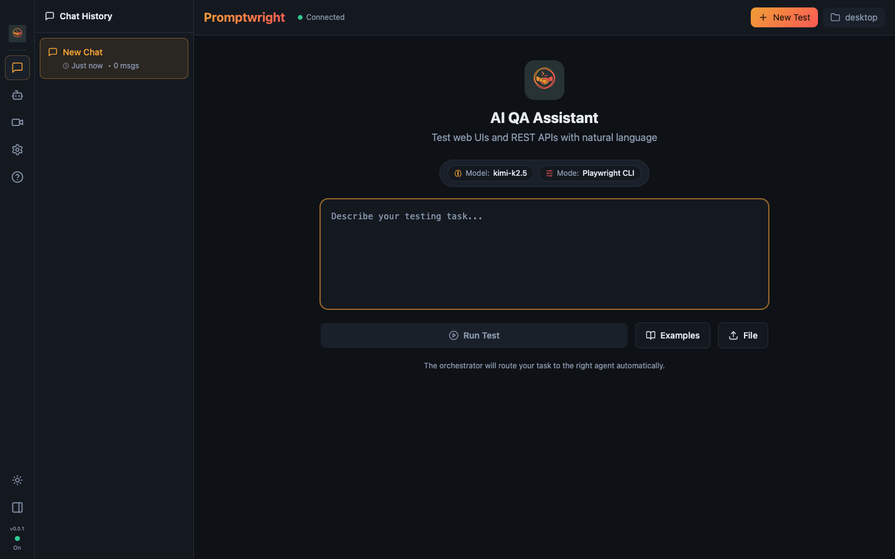
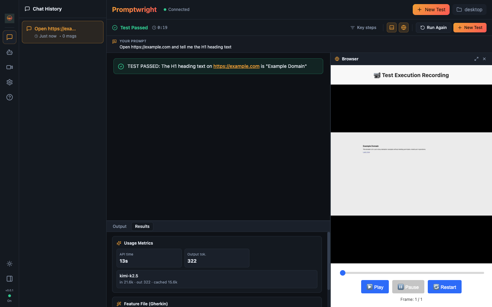
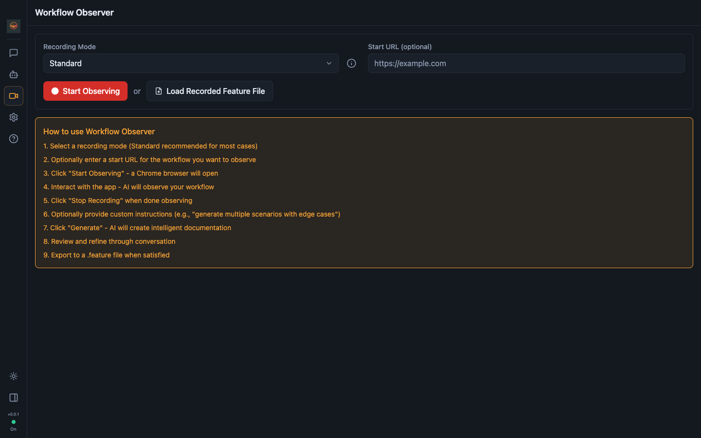
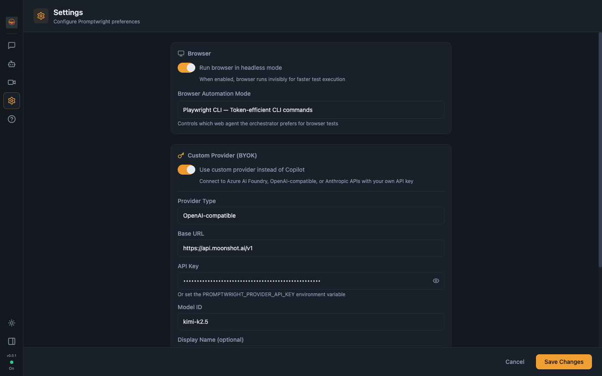
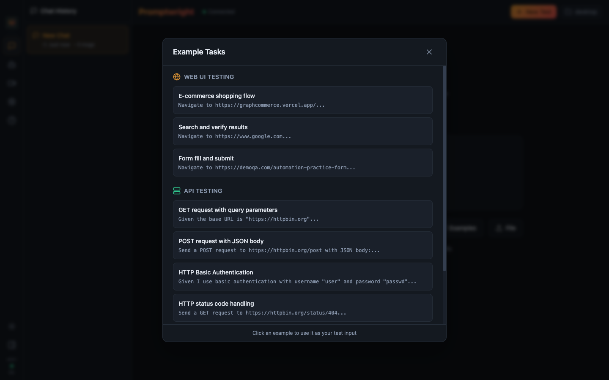

<p align="center">
  
</p>

<h1 align="center">Promptwright</h1>

<p align="center">
  <b>Prompt or record your browser. Get runnable tests.</b><br/>
  An AI QA agent that drives a real browser from natural language, or watches you click and turns it into Gherkin you can replay.
</p>

<p align="center">
  <i>Login-less. Bring your own model. Available as a desktop app and a CLI.</i>
</p>

---

> **Heads-up: migrated and rebuilt.** Promptwright has moved from the `testronai` organization to [`@sahajamit`](https://github.com/sahajamit), and it has been completely revamped. If you starred or forked the original, this is its new home (the old URL redirects here). What you are looking at is a ground-up rebuild, not the old codebase, so don't be surprised if it looks nothing like the version you remember.

## What is Promptwright

Promptwright started life under Testron AI as a tool that turned a natural-language prompt into an automated browser workflow and generated reusable Playwright, Cypress, and Selenium scripts. This release is a from-scratch rebuild for what agentic AI can do today. It is now a login-less, bring-your-own-key **Electron desktop app** that does the same job under the hood (plain English, or a recorded click-through, becomes a real browser driven by an AI agent and falls out as runnable tests), with a lot more on top: an IDE-style run workspace, a live browser view, record to Gherkin to replay, and any OpenAI-compatible model, cloud or local.

---

## See it in action

Promptwright was demoed live on the [TestGuild podcast with Joe Colantonio](https://www.youtube.com/watch?v=2c7P4du6hDQ) (July 2026). The clip below jumps straight to the demo: BYOK settings, then a plain-English prompt driving a real browser end to end and coming back with a verdict and a Gherkin scenario.

<p align="center">
  <a href="https://www.youtube.com/watch?v=2c7P4du6hDQ&t=524s">
    
  </a>
  <br/>
  <i>▶ Watch the 5-minute demo segment (starts at 8:44)</i><br/>
  Full episode: <a href="https://www.youtube.com/watch?v=2c7P4du6hDQ">https://www.youtube.com/watch?v=2c7P4du6hDQ</a>
</p>

---

## Download

Grab the latest desktop build from the [**Releases**](https://github.com/sahajamit/promptwright/releases/latest) page. No npm, no build step. Once it's installed, point it at your model provider (see [Quick start](#quick-start) for BYOK setup) and you're going.

> The app is currently **unsigned** (a code-signing certificate is on the roadmap), so your OS will warn you on first launch. The one-time steps below are expected and safe.

- **macOS (Apple Silicon / M-series)** — download the `.dmg` and drag Promptwright to Applications. On first launch, **right-click the app → Open** (or run `xattr -dr com.apple.quarantine /Applications/Promptwright.app`) to get past Gatekeeper's "unidentified developer" prompt. *(Intel Macs are not built yet.)*
- **Windows (x64)** — run `Promptwright-Setup-<version>.exe` (installer) or unzip the portable build. If SmartScreen appears, click **More info → Run anyway**.
- **Linux** — download the `.AppImage`, then `chmod +x Promptwright-*.AppImage && ./Promptwright-*.AppImage`.

Prefer to build from source instead? See [Quick start](#quick-start) below.

---

## Why Promptwright

Most "AI test" tools lock you into one vendor's model and a sign-in. Promptwright flips that:

- **Copilot is just the harness, you bring the model.** The GitHub Copilot runtime is bundled in, so there is no GitHub Copilot license, token, or global install required. Point it at your own provider key and go.
- **Any OpenAI-compatible provider.** OpenAI, Azure AI Foundry, Anthropic, Moonshot (Kimi), or a fully local model via Ollama. No cloud, no cost if you run local.
- **Two ways in.** Describe a test in plain English and watch it run, or hit record and let it observe your workflow and write the Gherkin for you.
- **Real browser, two engines.** Drives Chrome over CDP using either a token-efficient Playwright CLI agent or Playwright MCP.

---

## Screenshots

| Home | Live agentic execution |
|------|------------------------|
|  |  |

| Workflow Observer (record → Gherkin) | Settings (bring your own key) |
|--------------------------------------|-------------------------------|
|  |  |

<p align="center">
  
</p>

---

## Features

| | CLI | Desktop |
|---|:---:|:---:|
| Natural-language browser tests | ✅ | ✅ |
| Real-time streaming of agent steps | ✅ | ✅ |
| Login-less BYOK (any OpenAI-compatible provider) | ✅ | ✅ |
| Local models via Ollama | ✅ | ✅ |
| Orchestrator that routes to specialized agents | ✅ | ✅ |
| Playwright CLI **and** Playwright MCP modes | ✅ | ✅ |
| Conversation history | — | ✅ |
| Record → Gherkin (Workflow Observer) | — | ✅ |
| Replay generated scenarios | — | ✅ |
| Activity / execution logs panel | — | ✅ |

---

## How it works

You give Promptwright a task. An **orchestrator** classifies the intent and routes it to the right specialized agent:

- **`pw-cli-agent`** — runs web tests through the token-efficient Playwright CLI (connects to Chrome over CDP).
- **`pw-mcp-agent`** — runs web tests through Playwright MCP (rich tool integration).
- **`api-test-agent`** — exercises REST APIs.
- **`workflow-observer`** — watches a recorded session and turns it into Gherkin.

Each agent runs as its own model session, so the harness streams every step (route, navigate, snapshot, act, verdict) back to the UI in real time.

### Record, generate, replay

The Workflow Observer watches you interact with the browser, then writes a feature file:

```gherkin
Feature: User Login
  Scenario: Successful login
    Given I navigate to "https://example.com/login"
    When I type "user@test.com" in the email field
    And I type "password123" in the password field
    And I click the "Sign In" button
    Then I should see the dashboard
```

Refine it through conversation, then replay it to verify.

---

## Quick start

```bash
git clone https://github.com/sahajamit/promptwright.git
cd promptwright
pnpm install
pnpm build
```

Then pick a model provider (login-less, no GitHub sign-in):

### Option A — Moonshot / Kimi (verified for agentic browser work)

```bash
export PROMPTWRIGHT_PROVIDER_TYPE=openai
export PROMPTWRIGHT_PROVIDER_BASE_URL=https://api.moonshot.ai/v1
export PROMPTWRIGHT_PROVIDER_MODEL=kimi-k2.5
export PROMPTWRIGHT_PROVIDER_API_KEY=$MOONSHOT_API_KEY
```

### Option B — Fully local and free (Ollama)

```bash
ollama pull llama3.1:8b               # a tool-capable instruct model
export PROMPTWRIGHT_PROVIDER_TYPE=openai
export PROMPTWRIGHT_PROVIDER_BASE_URL=http://localhost:11434/v1
export PROMPTWRIGHT_PROVIDER_MODEL=llama3.1:8b
# no API key needed for local Ollama
```

### Option C — OpenAI / Azure / Anthropic

See [`promptwright.config.example.yaml`](promptwright.config.example.yaml) for copy-paste presets and the full field list (`bearerToken`, `wireApi`, `headers`, token limits).

> You can also configure the provider in the desktop app's **Settings → Custom Provider (BYOK)** instead of env vars.

---

## Usage

### Desktop app

```bash
# Development (hot reload)
pnpm --filter @promptwright/desktop dev

# Or run the built app
pnpm --filter @promptwright/desktop build
pnpm --filter @promptwright/desktop start
```

Type a task ("Go to example.com and verify the main heading"), hit **Run Test**, and watch the agent work. Or open **Record** to capture a workflow and generate a feature file.

### CLI

```bash
# After pnpm build
node packages/cli/dist/index.js

# With an explicit provider (flags override env)
node packages/cli/dist/index.js \
  --provider-type openai \
  --provider-url https://api.moonshot.ai/v1 \
  --provider-model kimi-k2.5 \
  --provider-key "$MOONSHOT_API_KEY"
```

---

## Model choice for agentic browser work

Agentic browsing requires a model that emits **structured tool calls** and stays coherent across a multi-step loop (route → navigate → snapshot → act). Not every model qualifies:

- ✅ **Kimi K2.5 (Moonshot)** — verified end-to-end on the Playwright CLI loop.
- ✅ Frontier OpenAI / Anthropic / Azure models.
- ⚠️ **Local models** — simple chat works broadly, but agentic tool-use is demanding. Small models can return tool calls as plain text (not executed) or empty content. Prefer a strong instruct model (14B+) with solid tool-calling, or a hosted provider.

For simple chat and exploration, most local models are fine.

---

## Configuration

Settings live in `promptwright.config.yaml` (or the desktop **Settings** panel). Highlights:

```yaml
browser:
  headless: true
  automationMode: playwright-cli   # or playwright-mcp

provider:                          # BYOK — login-less
  type: openai                     # openai | azure | anthropic
  baseUrl: https://api.moonshot.ai/v1
  model: kimi-k2.5
  # apiKey: ...                    # or PROMPTWRIGHT_PROVIDER_API_KEY env
```

Config-file values win; environment variables fill any gaps, so a pure `export`-and-run launch works too.

---

## Architecture

A pnpm monorepo with a shared core:

```
promptwright/
├── assets/                  # logo + screenshots
├── packages/
│   ├── core/                # @promptwright/core — Copilot SDK wrapper, orchestrator,
│   │                        #   agents, BYOK provider resolution, CDP, recording
│   ├── cli/                 # @promptwright/cli — terminal interface
│   └── desktop/             # @promptwright/desktop — Electron + React app
├── promptwright.config.example.yaml
└── README.md
```

| Package | Description |
|---------|-------------|
| `@promptwright/core` | Wraps the GitHub Copilot SDK with event streaming, the orchestrator + agent registry, and login-less BYOK provider resolution |
| `@promptwright/cli` | Terminal interface with colored, streamed output |
| `@promptwright/desktop` | Electron app with a React UI (chat, execution view, recorder, settings) |

**Requirements:** Node.js 22+ and pnpm. No GitHub Copilot login is required when a BYOK provider is configured.

---

## License

MIT.
