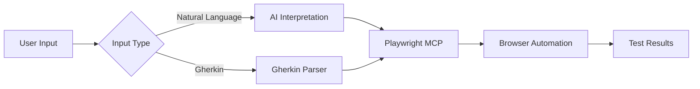
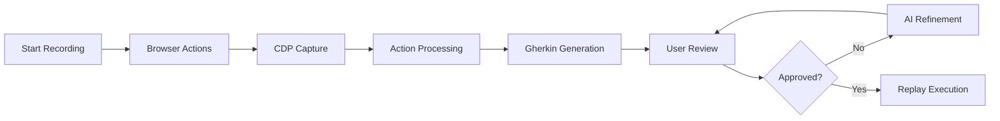
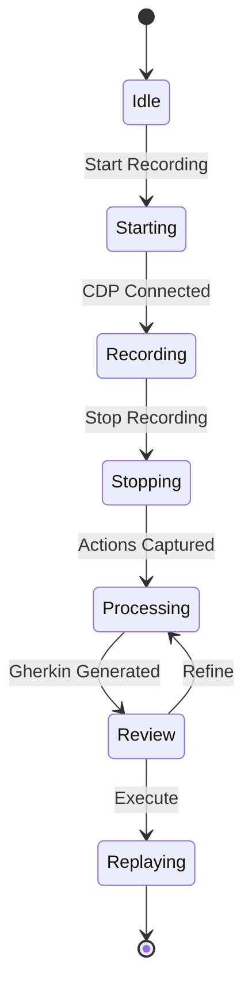
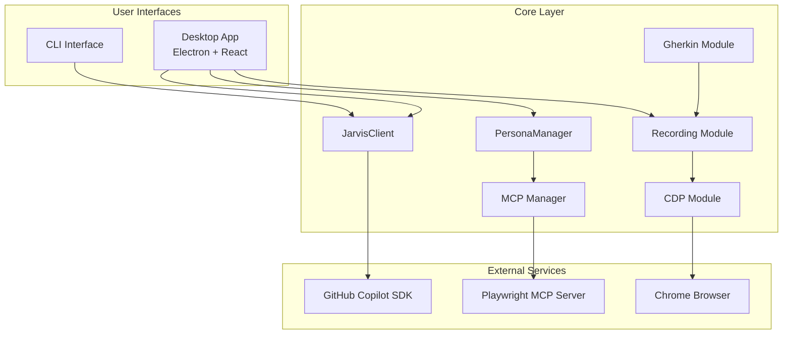
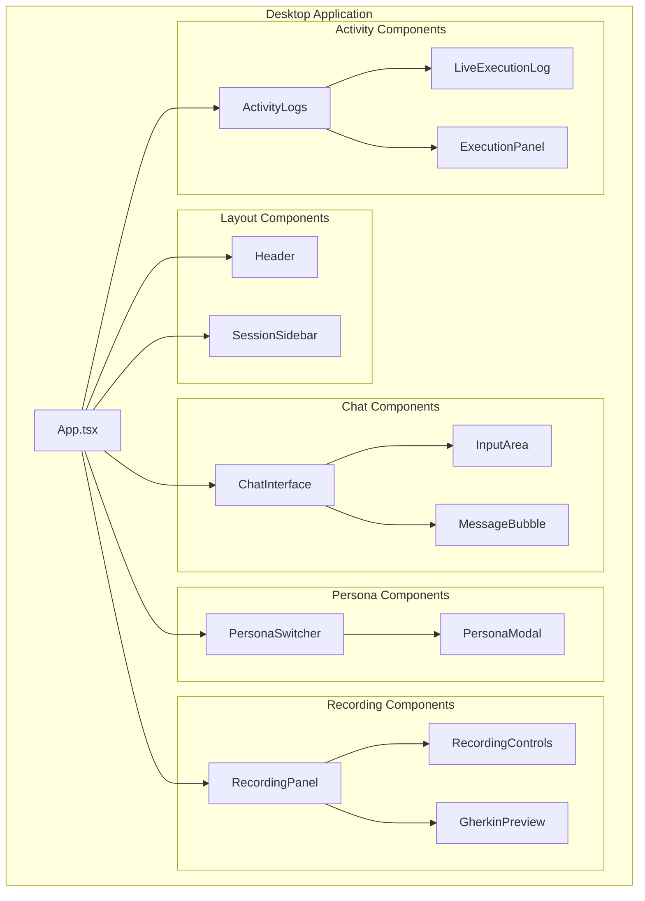
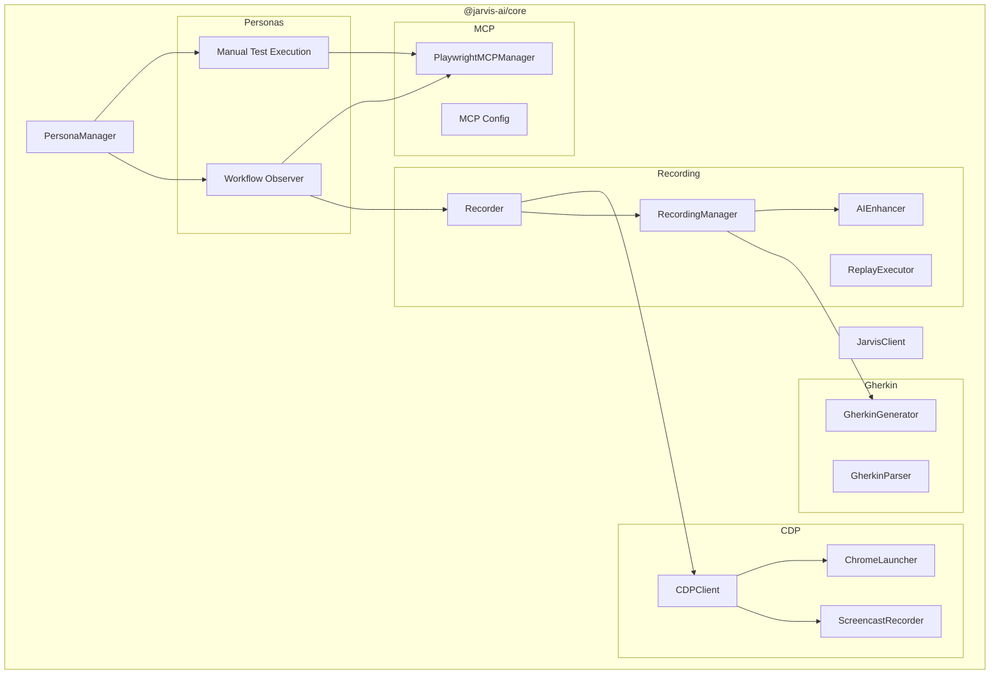
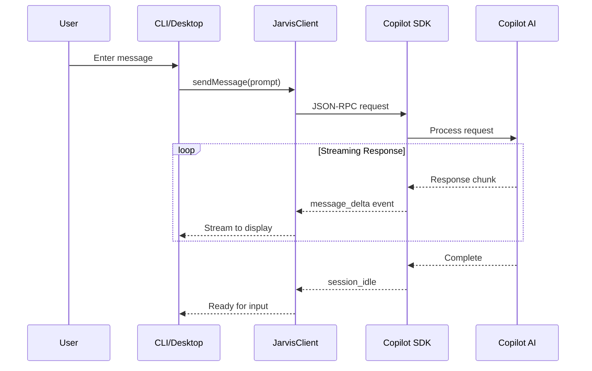
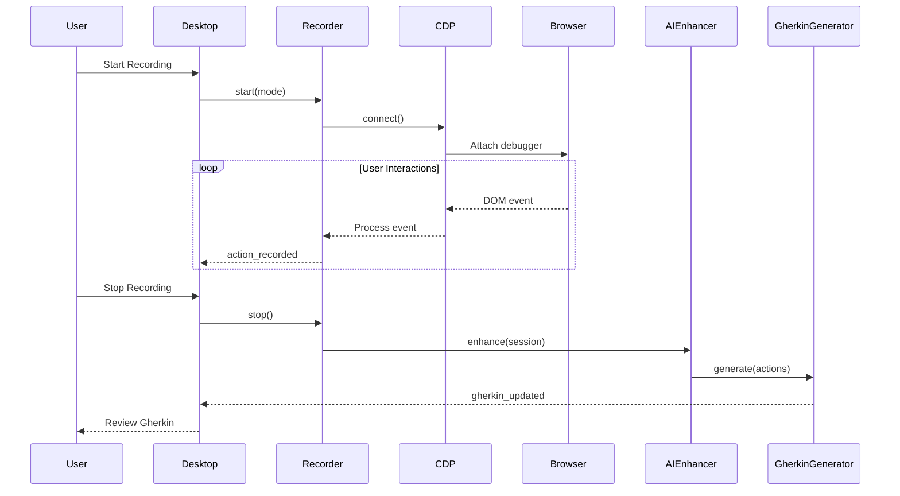

# JARVIS-AI Features Specification

A comprehensive QA Assistant powered by GitHub Copilot SDK, featuring two distinct personas for manual test execution and test recording workflows.

---

## Table of Contents

1. [Overview](#overview)
2. [Personas](#personas)
3. [Core Features](#core-features)
4. [Architecture](#architecture)
5. [Component Diagrams](#component-diagrams)
6. [Data Flow](#data-flow)
7. [Module Details](#module-details)

---

## Overview

JARVIS-AI is a monorepo-based QA assistant that provides:

- **CLI Interface**: Terminal-based chat with streaming responses
- **Desktop App**: Modern Electron app with React UI
- **Two Specialized Personas**: Each tailored for different QA workflows
- **Browser Automation**: Via Playwright MCP (Model Context Protocol)
- **Test Recording**: Via Chrome DevTools Protocol (CDP)
- **Gherkin Support**: Generate and parse BDD test scenarios

---

## Personas

JARVIS-AI supports two distinct personas, each optimized for different testing workflows:

### 🎭 Manual Test Execution Persona

**Purpose**: Execute manual test cases using browser automation with Playwright.

| Feature | Description |
|---------|-------------|
| Natural Language Input | Accept test scenarios written in plain English |
| Gherkin/BDD Support | Parse and execute Gherkin feature files |
| Playwright MCP Integration | Browser automation via Model Context Protocol |
| Dynamic MCP Configuration | Automatically adapts when new MCP servers are added |
| Skill Documentation | Includes SKILL.md for AI guidance |



### 👁️ Workflow Observer Persona

**Purpose**: AI observes browser workflows, learns from interactions, and creates intelligent documentation including Gherkin test scenarios.

| Feature | Description |
|---------|-------------|
| CDP Recording | Capture browser interactions via Chrome DevTools Protocol |
| Gherkin Generation | Convert recorded actions to BDD scenarios |
| AI Enhancement | Refine recorded actions with AI |
| Interactive Review | Edit and refine Gherkin through conversation |
| Replay Execution | Execute generated tests via Playwright MCP |



---

## Core Features

### Real-time Streaming

Both CLI and Desktop interfaces support real-time streaming of AI responses:

- **Message Deltas**: See responses character-by-character
- **Reasoning Visibility**: Optional verbose mode shows AI thinking process
- **Tool Execution Logs**: Track Playwright MCP operations

### Conversation Management

- **Persistent Threads**: Desktop app maintains conversation history
- **Session Management**: Create, switch, and delete chat sessions
- **Working Directory Context**: Set project context for code-related tasks

### Recording Capabilities



**Recording Modes:**

| Mode | Description |
|------|-------------|
| Standard | Captures clicks, typing, navigation, form submissions, significant scrolls |
| Detailed | All standard events plus hovers, focus/blur, mouse movement, network requests |

**Captured Action Types:**
- `click` - Mouse clicks
- `type` - Keyboard input
- `navigate` - URL changes
- `scroll` - Significant scrolling
- `hover` - Mouse hover events
- `submit` - Form submissions
- `focus` / `blur` - Element focus changes
- `select` - Dropdown selections
- `check` / `uncheck` - Checkbox interactions

### Gherkin Support

**Generation**: Convert recorded browser sessions to BDD feature files

**Parsing**: Parse existing Gherkin files for execution

```gherkin
Feature: User Login
  Scenario: Successful login with valid credentials
    Given I am on the login page
    When I enter username "user@example.com"
    And I enter password "password123"
    And I click the login button
    Then I should see the dashboard
```

### Browser Automation

Via Playwright MCP, JARVIS-AI can:

- Navigate to URLs
- Click elements
- Type text
- Take screenshots
- Handle dialogs
- Execute JavaScript
- Manage browser tabs

---

## Architecture

### High-Level Architecture



### Package Structure

```
jarvis-ai/
├── packages/
│   ├── core/                 # Shared logic and SDK wrapper
│   │   └── src/
│   │       ├── client.ts     # JarvisClient - Copilot SDK wrapper
│   │       ├── types.ts      # Shared type definitions
│   │       ├── personas/     # Persona definitions and management
│   │       ├── mcp/          # MCP configuration and management
│   │       ├── cdp/          # Chrome DevTools Protocol client
│   │       ├── recording/    # Browser recording functionality
│   │       └── gherkin/      # Gherkin generation and parsing
│   │
│   ├── cli/                  # Terminal interface
│   │   └── src/
│   │       ├── index.ts      # CLI entry point
│   │       └── ui/           # Terminal UI helpers
│   │
│   └── desktop/              # Electron + React app
│       └── src/
│           ├── main/         # Electron main process
│           ├── preload.ts    # IPC bridge
│           └── renderer/     # React application
│               ├── components/
│               ├── hooks/
│               └── lib/
```

---

## Component Diagrams

### Desktop App Components



### Core Module Dependencies



---

## Data Flow

### Message Flow (CLI/Desktop → Copilot)



### Recording Flow



---

## Module Details

### JarvisClient

The main wrapper around GitHub Copilot SDK providing:

| Method | Description |
|--------|-------------|
| `start()` | Initialize Copilot session |
| `sendMessage(prompt)` | Send user message |
| `sendAndWait(prompt, timeout)` | Send and wait for completion |
| `abort()` | Cancel current processing |
| `stop()` | Cleanup and disconnect |
| `setWorkDir(path)` | Update working directory |
| `setSystemPrompt(prompt)` | Configure AI behavior |
| `listModels()` | Get available AI models |

### PersonaManager

Manages persona lifecycle and MCP coordination:

| Method | Description |
|--------|-------------|
| `register(persona)` | Register a persona |
| `select(personaId)` | Activate a persona |
| `getActive()` | Get current persona |
| `getRequiredMCPs()` | Get MCP requirements |
| `getSystemPrompt()` | Get active system prompt |

### RecordingManager

Orchestrates browser recording sessions:

| Method | Description |
|--------|-------------|
| `startRecording(mode)` | Begin recording |
| `stopRecording()` | End and process recording |
| `pauseRecording()` | Pause without stopping |
| `getStatus()` | Get current state |
| `onEvent(handler)` | Subscribe to events |

### GherkinGenerator

Converts recorded actions to BDD scenarios:

| Method | Description |
|--------|-------------|
| `generate(session)` | Generate Gherkin from session |
| `refine(gherkin, feedback)` | Refine with AI feedback |
| `merge(chunks)` | Combine multiple chunks |

### CDPClient

Chrome DevTools Protocol client for browser control:

| Method | Description |
|--------|-------------|
| `connect(options)` | Connect to browser |
| `disconnect()` | Close connection |
| `injectScript()` | Inject recording script |
| `captureScreenshot()` | Take screenshot |

---

## Technology Stack

| Layer | Technology |
|-------|------------|
| AI Backend | GitHub Copilot SDK |
| Desktop Framework | Electron 33 |
| UI Framework | React 19 |
| Styling | Tailwind CSS |
| Build Tool | Vite 6 |
| Browser Automation | Playwright MCP |
| Browser Recording | Chrome DevTools Protocol |
| Package Manager | pnpm |
| Language | TypeScript 5.3 |
