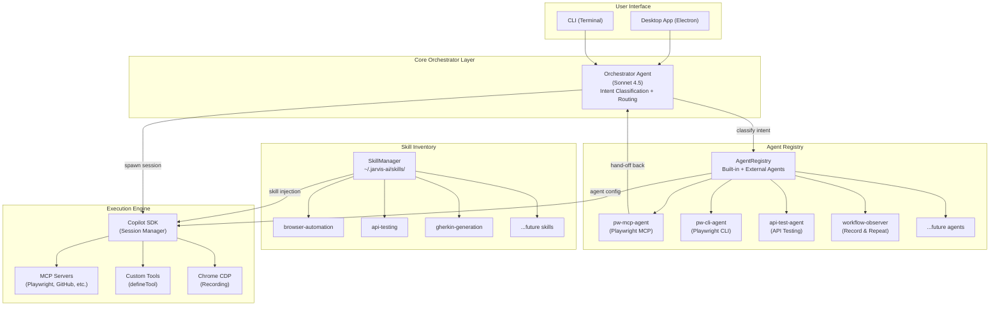
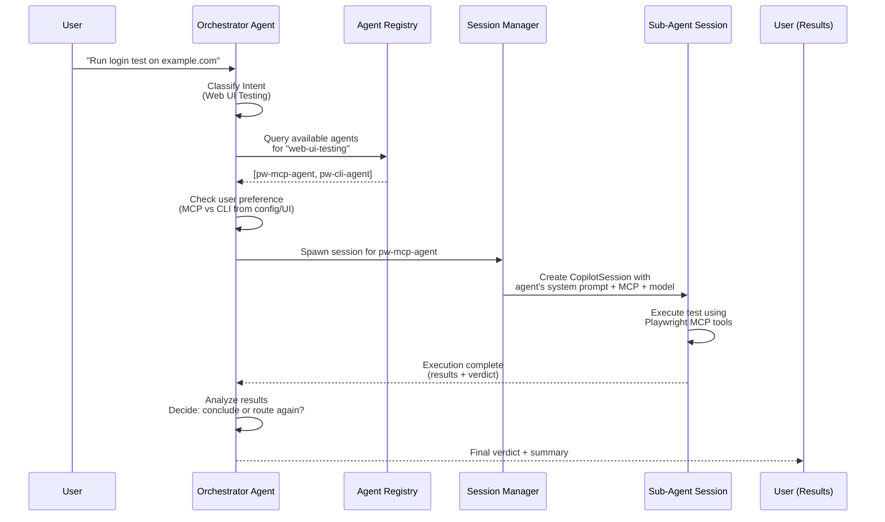
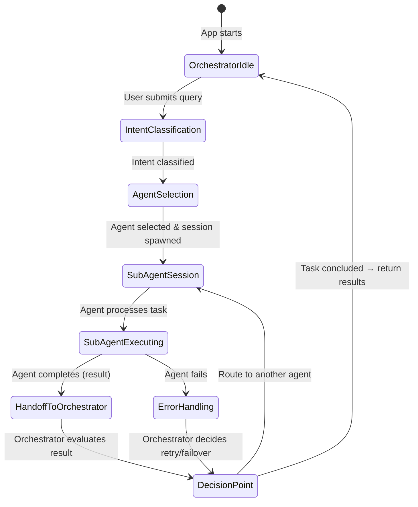
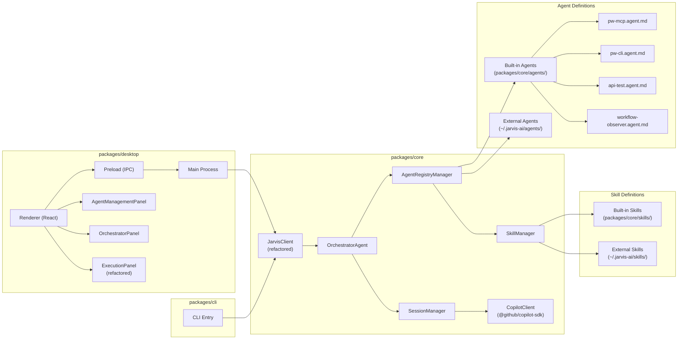

# JARVIS-AI: Agent-Based Orchestration Architecture Plan

## Problem Statement

JARVIS-AI currently uses a **persona-based architecture** where personas (Manual Test Execution, Workflow Observer, API Test Execution) are essentially static configurations of system prompts + MCP servers. This approach:

1. **Lacks composability** — adding new capabilities requires code changes to register personas
2. **No orchestration** — users must manually select the right persona; no intelligent routing
3. **Tightly coupled** — persona logic is embedded in TypeScript, not portable/extensible
4. **Limited extensibility** — can't add new agents/skills without updating the app

## Proposed Approach

Transform JARVIS-AI into a **hybrid orchestrator architecture** where:

- A **main orchestrator agent** (using a high-capability model like Sonnet 4.5) classifies user intent and routes to specialized **sub-agents**
- Sub-agents run in **dedicated Copilot SDK sessions** with their own system prompts, tools, MCP servers, and model configurations
- Agent definitions use **Copilot CLI-compatible `.agent.md` format** for ecosystem portability
- Skills use **`SKILL.md` directory format** discoverable from `~/.jarvis-ai/skills/`
- The persona system is **replaced** by the agent system (existing personas become built-in agents)
- The UI shows **transparent orchestrator reasoning** (which agent was selected and why)
- Both **CLI and Desktop** adopt the new architecture (shared core)

## Architecture Overview

### High-Level Flow



### Orchestrator Routing Flow (Sequential)



### Agent Handoff Pattern



## Architecture Diagram (Component View)



## Phase Breakdown

---

### PHASE 1: Core Architecture — Agent Registry & Orchestrator Engine

**Goal**: Build the foundational agent system in `packages/core`, replacing the persona system.

#### 1.1 — Agent Definition Format & Parser

Create a parser for `.agent.md` files (Copilot CLI-compatible format):

```markdown
---
name: "pw-mcp-agent"
displayName: "Playwright MCP Agent"
description: "Executes web UI tests using Playwright MCP browser automation"
model: "claude-sonnet-4"
tools: "playwright_navigate, playwright_click, playwright_fill, playwright_screenshot"
category: "web-ui-testing"
---

You are a specialized Web UI test execution agent...

## Capabilities
- Navigate to URLs and interact with web pages
- Fill forms, click buttons, verify content
- Take screenshots for visual verification
- Report test verdicts (PASS/FAIL)

## Instructions
[Full system prompt for this agent]
```

**Files to create:**
- `packages/core/src/agents/types.ts` — `AgentDefinition`, `AgentConfig`, `AgentMetadata` interfaces
- `packages/core/src/agents/parser.ts` — Parse `.agent.md` files (YAML frontmatter + markdown body)
- `packages/core/src/agents/validator.ts` — Validate agent definitions

#### 1.2 — Skill Definition Format & Parser

Create a parser for `SKILL.md` directory-based skills:

```
~/.jarvis-ai/skills/browser-automation/
├── SKILL.md
└── helpers/
    └── locator-strategies.md
```

**SKILL.md format:**
```markdown
---
name: "browser-automation"
description: "Browser automation patterns and strategies"
tools: "playwright_navigate, playwright_click"
---

# Browser Automation Skill

Instructions for browser automation...
```

**Files to create:**
- `packages/core/src/skills/types.ts` — `SkillDefinition`, `SkillMetadata` interfaces
- `packages/core/src/skills/parser.ts` — Parse SKILL.md files
- `packages/core/src/skills/manager.ts` — `SkillManager` class (discover, load, validate skills)

#### 1.3 — Agent Registry Manager

Central registry for discovering, loading, and managing agents.

**Responsibilities:**
- Scan built-in agents from `packages/core/src/agents/built-in/`
- Scan external agents from `~/.jarvis-ai/agents/`
- Provide agent lookup by name, category, or capability
- Merge agent definitions with skill definitions
- Resolve agent MCP server requirements

**Files to create:**
- `packages/core/src/agents/registry.ts` — `AgentRegistry` class
- `packages/core/src/agents/built-in/pw-mcp.agent.md` — Playwright MCP agent (migrated from persona)
- `packages/core/src/agents/built-in/pw-cli.agent.md` — Playwright CLI agent (migrated from persona)
- `packages/core/src/agents/built-in/api-test.agent.md` — API test agent (migrated from persona)
- `packages/core/src/agents/built-in/workflow-observer.agent.md` — Workflow Observer agent (migrated from persona)
- `packages/core/src/agents/built-in/orchestrator.agent.md` — Orchestrator agent definition

#### 1.4 — Session Manager (Multi-Session) with Unified Event Proxy

Manage multiple concurrent Copilot SDK sessions — one for orchestrator, one per active sub-agent.

**Responsibilities:**
- Create orchestrator session on startup (persistent)
- Spawn sub-agent sessions on demand (ephemeral or reusable)
- Handle session lifecycle (create → active → complete → destroy)
- **Unified event proxy** — forward events from sub-agent sessions to the UI through the SAME `jarvis-event` IPC channel, preserving the existing event contract
- Map between UI session IDs and Copilot session IDs

**Critical Design: Unified Event Proxy for Live Preview & Logs Continuity**

The current UI relies on a **single `jarvis-event` IPC channel** and a **single `execution:screencast-frame` IPC channel** to drive:
- `LiveExecutionLog` — real-time tool calls, messages, verdicts
- `useTestExecution` hook — builds `ExecutionMessage[]` array from events
- Live browser preview — JPEG frames from `ScreencastRecorder`
- `ActivityLogs` panel — tool execution tiles, thinking blocks, prompts

**This MUST NOT break.** The `AgentSessionManager` must act as an **event proxy** that:

1. **Subscribes** to events from the active sub-agent's Copilot SDK session
2. **Tags** each event with agent metadata (`agentName`, `agentDisplayName`)
3. **Re-emits** events through the same `JarvisEvent` type interface so the renderer receives them identically
4. **Routes screencast frames** from the active sub-agent's recording through the same `execution:screencast-frame` channel
5. **Switches** event subscriptions when the orchestrator hands off from one sub-agent to another

```typescript
// AgentSessionManager event proxy pattern
class AgentSessionManager {
  private activeAgentSession: CopilotSession | null = null;
  private activeAgentName: string | null = null;

  async spawnAgentSession(agent: AgentDefinition): Promise<CopilotSession> {
    // Unsubscribe from previous agent's events
    if (this.activeAgentSession) {
      this.cleanupAgentEvents();
    }

    const session = await this.copilotClient.createSession({
      model: agent.model,
      systemMessage: { mode: "replace", content: agent.prompt },
      mcpServers: agent.mcpServers,
    });

    this.activeAgentSession = session;
    this.activeAgentName = agent.name;

    // Proxy sub-agent events through the unified event emitter
    // so the UI receives them identically to the current single-session flow
    session.on((event) => {
      this.emit("event", {
        ...this.mapToJarvisEvent(event),
        _agentName: this.activeAgentName,  // metadata tag (UI can use optionally)
      });
    });

    return session;
  }
}
```

**Key invariant:** The renderer's `window.jarvis.onEvent(callback)` subscription continues to work without changes for live logs and live preview. Agent metadata is additive (new optional fields), not breaking.

**Files to create/modify:**
- `packages/core/src/agents/session-manager.ts` — `AgentSessionManager` class with event proxy
- Modify `packages/core/src/client.ts` — Integrate `AgentSessionManager`
- Modify `packages/core/src/types.ts` — Add optional `agentName` field to `JarvisEvent` union members

#### 1.5 — Orchestrator Agent

The brain of JARVIS-AI — classifies intent and routes to sub-agents.

**Implementation approach:**
- Runs in its own Copilot SDK session with a high-capability model (Sonnet 4.5)
- System prompt includes: list of registered agents (name, description, category), routing instructions
- Uses a **custom tool** (`route_to_agent`) that the orchestrator model calls to delegate work
- The tool handler spawns a sub-agent session and waits for completion
- After sub-agent completion, orchestrator evaluates results and decides next action

**Key design:**
```typescript
// Custom tool: route_to_agent
defineTool("route_to_agent", {
  description: "Route the current task to a specialized agent",
  parameters: {
    agentName: "string — name of the agent to route to",
    taskDescription: "string — what the agent should do",
    userPreferences: "object — any preferences (e.g., MCP vs CLI)"
  },
  handler: async ({ agentName, taskDescription, userPreferences }) => {
    const agent = registry.getAgent(agentName);
    const session = await sessionManager.spawnAgentSession(agent);
    const result = await session.sendAndWait({ prompt: taskDescription });
    return result; // Returns to orchestrator for evaluation
  }
});
```

**Files to create:**
- `packages/core/src/agents/orchestrator.ts` — `OrchestratorAgent` class
- `packages/core/src/agents/tools/route-to-agent.ts` — Route-to-agent custom tool
- `packages/core/src/agents/tools/list-agents.ts` — List-agents tool for orchestrator

#### 1.6 — Remove Persona System

**Migrate persona code to agent system:**
- `PersonaManager` → `AgentRegistry` + `OrchestratorAgent`
- `Persona` interface → `AgentDefinition` interface
- Persona system prompts → `.agent.md` files
- Persona MCP configs → Agent MCP configs in `.agent.md` metadata
- Intent classification → Orchestrator agent classification

**Files to modify:**
- Remove or deprecate `packages/core/src/personas/` (keep for backward compat reference)
- Modify `packages/core/src/client.ts` — Replace persona references with agent references
- Modify `packages/core/src/index.ts` — Update exports

#### 1.7 — Configuration System Updates

**New config structure (`jarvis.config.yaml`):**
```yaml
orchestrator:
  model: "claude-sonnet-4-5-20250514"
  autoRoute: true  # Auto-route vs ask user

agents:
  pw-mcp-agent:
    model: "claude-sonnet-4"    # Override default model
    enabled: true
  pw-cli-agent:
    model: "claude-sonnet-4"
    enabled: true
  api-test-agent:
    model: "gpt-4.1"
    enabled: true

skills:
  directories:
    - "~/.jarvis-ai/skills"
  enabled:
    - "browser-automation"
    - "api-testing"

browser:
  headless: true
  automationMode: "playwright-mcp"

lastUsedAgent: "pw-mcp-agent"
```

**Files to modify:**
- `packages/core/src/config.ts` (or equivalent) — Add agent/skill config sections
- `jarvis.config.example.yaml` — Update with new structure

---

### PHASE 2: Desktop App UI Adaptation

**Goal**: Update the Electron desktop app to support the agent-based architecture.

#### 2.1 — Agent Selection Modal (Replace PersonaModal)

Replace the persona selection modal with an agent-aware version:

- Show all registered agents (built-in + external) in a categorized grid
- Each agent card shows: icon, name, description, model, required skills/MCPs
- "Built-in" vs "External" badges
- Category filters (Web UI, API, Recording, etc.)
- Agent configuration button (model override, enable/disable)

#### 2.2 — Orchestrator Transparency Panel

New UI component showing the orchestrator's decision-making:

```
┌─────────────────────────────────────────┐
│ 🧠 Orchestrator Decision               │
│                                          │
│ Intent: Web UI Test Execution            │
│ Selected Agent: pw-mcp-agent             │
│ Reason: Query involves browser testing   │
│         with Playwright MCP preference   │
│ Model: claude-sonnet-4                   │
│                                          │
│ ▸ View full reasoning                    │
└─────────────────────────────────────────┘
```

- Collapsible panel at the top of ExecutionPanel
- Shows intent classification, agent selection, reasoning
- Updates in real-time as orchestrator processes

#### 2.3 — Live Execution Logs & Browser Preview Preservation (CRITICAL)

**Goal**: Ensure `LiveExecutionLog`, `useTestExecution`, and live browser preview continue to work identically after the multi-agent refactor.

**Current event flow (MUST be preserved):**
```
CopilotSession events → JarvisClient.onEvent() → IPC "jarvis-event" → window.jarvis.onEvent()
  → useTestExecution hook → builds ExecutionMessage[] → LiveExecutionLog renders

ScreencastRecorder frames → IPC "execution:screencast-frame" → window.jarvis.execution.onScreencastFrame()
  → LiveExecutionLog renders live JPEG 
```

**Design constraints:**
1. **`useTestExecution` hook** subscribes to `window.jarvis.onEvent()` and processes `message_delta`, `message_complete`, `tool_start`, `tool_complete`, `session_idle`, `session_error` events. These event types and their payload shapes MUST NOT change.
2. **`LiveExecutionLog`** subscribes to `window.jarvis.execution.onScreencastFrame()` for live JPEG frames. The screencast stream from the active sub-agent's CDP session MUST flow through the same channel.
3. **`ActivityLogs`** receives `LogEntry` objects derived from the same event stream. The existing `LogEntry` structure MUST be preserved.

**Implementation approach:**
- The `AgentSessionManager` event proxy (Phase 1.4) ensures sub-agent events flow through the same IPC channel
- The main process's `jarvisClient.onEvent()` handler continues to broadcast on `"jarvis-event"` — it now receives events from whichever sub-agent is active
- `ScreencastRecorder` is associated with the active sub-agent session's CDP connection. When the orchestrator switches agents, the screencast subscription switches too, but the renderer still receives frames on the same `"execution:screencast-frame"` channel
- **No changes needed** to `useTestExecution.ts`, `LiveExecutionLog.tsx`, or the preload bridge for basic functionality

**Additive enhancements (optional metadata):**
- Events MAY include an optional `_agentName: string` field that the UI can display but is not required to process
- This allows the execution log to optionally show "▸ pw-mcp-agent" labels without breaking existing rendering

**Files to verify (NO breaking changes):**
- `packages/desktop/src/renderer/hooks/useTestExecution.ts` — verify event handler still works
- `packages/desktop/src/renderer/components/LiveExecutionLog.tsx` — verify frame subscription works
- `packages/desktop/src/preload.ts` — no IPC channel name changes needed

#### 2.4 — ExecutionPanel Refactoring

Modify ExecutionPanel to work with the agent system:

- Remove persona-specific logic (intent classification was in UI → now in orchestrator)
- Add orchestrator event handling (new event types: `agent_selected`, `routing_decision`, `handoff`)
- Show which agent is currently executing in the execution header
- Support agent handoff visualization (when orchestrator routes to different agent)
- **Preserve**: `useTestExecution` hook subscription pattern — it continues to work unchanged because events arrive on the same channel

#### 2.5 — Activity Panel Agent-Aware UX Enhancements

Enhance the right-side `ActivityLogs` panel to show **which agent** generated each activity tile, providing clear attribution and context.

**Current state:** Activity tiles (`LogEntry`) show tool name, args, result, status but have NO concept of which agent triggered them. All activity looks identical regardless of source.

**Enhanced `LogEntry` structure:**
```typescript
export interface LogEntry {
  // ... existing fields preserved ...
  id: string;
  type: "tool" | "thinking" | "info" | "error" | "recording" | "prompt";
  content: string;
  timestamp: number;
  status?: "running" | "completed" | "failed";
  toolName?: string;
  toolArgs?: string;
  toolResult?: string;

  // NEW: Agent attribution fields
  agentName?: string;         // e.g., "pw-mcp-agent", "orchestrator"
  agentDisplayName?: string;  // e.g., "Playwright MCP Agent", "Orchestrator"
  agentCategory?: string;     // e.g., "web-ui-testing", "orchestration"
}
```

**UI changes to `ActivityLogs.tsx`:**

1. **Agent label badge on each tile:**
   ```
   ┌─────────────────────────────────────────┐
   │ 🔧 playwright_navigate          ▾      │
   │ ┌──────────────────┐                    │
   │ │ 🤖 pw-mcp-agent  │  2:34:12 PM       │
   │ └──────────────────┘                    │
   │ Args: { url: "https://example.com" }    │
   │ Result: Navigated successfully          │
   └─────────────────────────────────────────┘

   ┌─────────────────────────────────────────┐
   │ 🧠 route_to_agent               ▾      │
   │ ┌──────────────────┐                    │
   │ │ 🧠 Orchestrator  │  2:34:10 PM       │
   │ └──────────────────┘                    │
   │ Args: { agentName: "pw-mcp-agent" }    │
   │ Result: Task delegated                  │
   └─────────────────────────────────────────┘
   ```

2. **Agent-colored left border:**
   - Orchestrator tiles: purple/violet left border
   - Sub-agent tiles: agent-specific color (blue for web-ui, green for api, orange for recording)
   - Unattributed/legacy tiles: default gray border (backward compat)

3. **Agent section separators:**
   When the active agent changes during execution, insert a visual separator:
   ```
   ┌─────────────────────────────────────────┐
   │ ── 🧠 Orchestrator ──────────────────── │
   └─────────────────────────────────────────┘
   │ [orchestrator activity tiles]           │
   ┌─────────────────────────────────────────┐
   │ ── 🤖 pw-mcp-agent ──────────────────── │
   └─────────────────────────────────────────┘
   │ [pw-mcp-agent activity tiles]           │
   ┌─────────────────────────────────────────┐
   │ ── 🧠 Orchestrator ──────────────────── │
   └─────────────────────────────────────────┘
   │ [orchestrator evaluation tiles]         │
   ```

4. **Agent filter dropdown (optional):**
   - At the top of ActivityLogs: filter by agent ("All", "Orchestrator", "pw-mcp-agent", etc.)
   - Useful when many agents produce activity and user wants to focus on one

5. **Tooltip on agent badge:**
   - Hover shows: agent description, model being used, category

**How agent metadata flows to ActivityLogs:**
- `AgentSessionManager` tags events with `_agentName` (Phase 1.4)
- Main process event handler enriches `LogEntry` with `agentName` and `agentDisplayName` when creating log entries from events
- `ActivityLogs.tsx` reads these optional fields and renders agent badges when present
- **Backward compatible**: if `agentName` is undefined (legacy/pre-migration), tiles render without agent badges (current behavior)

**Files to modify:**
- `packages/desktop/src/renderer/types.ts` — Add `agentName`, `agentDisplayName`, `agentCategory` to `LogEntry`
- `packages/desktop/src/renderer/components/ActivityLogs.tsx` — Agent badge rendering, colored borders, section separators, optional filter dropdown
- `packages/desktop/src/main/index.ts` — Enrich `LogEntry` creation with agent metadata from events

#### 2.6 — Settings Panel Updates

- Replace per-persona model config with per-agent model config
- Add orchestrator model selection
- Add skill management (enable/disable skills)
- Add agent management (enable/disable agents)
- Add agent discovery path config

#### 2.7 — IPC & Preload Updates

New IPC channels:
```typescript
// Agent management
"agent:list"              → AgentMetadata[]
"agent:getActive"         → string (active agent name)
"agent:configure"         → void (update agent config)

// Orchestrator
"orchestrator:getState"   → OrchestratorState
"orchestrator:setModel"   → void

// Skill management  
"skill:list"              → SkillMetadata[]
"skill:enable/disable"    → void

// EXISTING event channel (jarvis-event) — PRESERVED, enhanced with agent metadata
// All events continue to flow through "jarvis-event" IPC channel
// New OPTIONAL fields added to existing event types:
type EnhancedJarvisEvent = JarvisEvent & {
  _agentName?: string;        // Which agent emitted this event
  _agentDisplayName?: string; // Human-readable agent name
};

// New event types ADDED to the jarvis-event channel (additive, not breaking):
type AgentEvent = 
  | { type: "orchestrator:classifying" }
  | { type: "orchestrator:agent_selected"; agent: string; reason: string; model: string }
  | { type: "orchestrator:handoff"; from: string; to: string }
  | { type: "agent:executing"; agent: string; agentDisplayName: string }
  | { type: "agent:complete"; agent: string; result: any }
```

#### 2.8 — Left Toolbar Panel (VS Code-style Activity Bar)

Replace the current header-based sidebar/activity toggles with a **persistent left toolbar** (activity bar) inspired by VS Code. This becomes the primary navigation for the app, housing icons for chat history, agents, skills, settings, and activity logs.

**Current layout (BEFORE):**
```
┌──────────────────────────────────────────────────────────────────┐
│ HEADER: [☰ToggleSidebar] [Logo JARVIS-AI ●Connected]  [...buttons] [📊ToggleActivity] │
├──────────────────────────────────────────────────────────────────┤
│ SessionSidebar │         ChatInterface          │ ActivityLogs  │
│   (w-64)       │          (flex-1)              │   (w-80)      │
│  [optional]    │                                │  [optional]   │
└──────────────────────────────────────────────────────────────────┘
```

**New layout (AFTER):**
```
┌──────────────────────────────────────────────────────────────────────────┐
│ HEADER: [Logo JARVIS-AI ●Connected]     [PersonaSwitcher] [➕New] [📁]  │
├────┬─────────────────────────────────────────────────────────────────────┤
│    │                                                                     │
│ T  │  Side Panel (contextual)  │       Main Content Area                │
│ O  │  ┌─────────────────────┐  │       ┌──────────────────────────────┐ │
│ O  │  │ Content changes     │  │       │                              │ │
│ L  │  │ based on active     │  │       │   ChatInterface / Execution  │ │
│ B  │  │ toolbar icon:       │  │       │         Panel                │ │
│ A  │  │                     │  │       │        (flex-1)              │ │
│ R  │  │ 💬 → Chat History   │  │       │                              │ │
│    │  │ 🤖 → Agents Panel   │  │       │                              │ │
│ w  │  │ ⚡ → Skills Panel   │  │       │                              │ │
│ -  │  │ 📊 → Activity Logs  │  │       │                              │ │
│ 1  │  │ ⚙️ → Settings       │  │       │                              │ │
│ 2  │  │                     │  │       │                              │ │
│    │  │ (w-72, 288px)       │  │       │                              │ │
│    │  └─────────────────────┘  │       └──────────────────────────────┘ │
│    │         ↕ resizable        │                                       │
│ ┌──┤                           │                                       │
│ │💬│  (panel can be collapsed  │                                       │
│ │🤖│   by clicking active icon │                                       │
│ │⚡│   again, like VS Code)    │                                       │
│ │📊│                           │                                       │
│ │──│                           │                                       │
│ │⚙️│                           │                                       │
│ └──┘                           │                                       │
├────┴─────────────────────────────────────────────────────────────────────┤
```

**Detailed toolbar layout (collapsed — icon only, w-12/48px):**
```
┌──────┐
│      │
│  💬  │  Chat History (tooltip: "Chat History")
│      │
│  🤖  │  Agents (tooltip: "Agents")
│      │
│  ⚡  │  Skills (tooltip: "Skills")
│      │
│  📊  │  Activity Logs (tooltip: "Activity")
│      │
│ ──── │  (visual separator)
│      │
│  ⚙️  │  Settings (tooltip: "Settings")
│      │
│      │
│      │  (spacer — pushes bottom icons down)
│      │
│  ◀▶  │  Expand/Collapse toolbar (tooltip: "Expand sidebar")
│      │
└──────┘
```

**Detailed toolbar layout (expanded — icon + label, w-48/192px):**
```
┌──────────────────┐
│                  │
│  💬 Chat History │
│                  │
│  🤖 Agents      │
│                  │
│  ⚡ Skills       │
│                  │
│  📊 Activity    │
│                  │
│ ──────────────── │
│                  │
│  ⚙️ Settings     │
│                  │
│                  │
│                  │
│  ◀ Collapse     │
│                  │
└──────────────────┘
```

**Complete app layout with toolbar + panel open (e.g., Agents panel selected):**
```
┌─────────────────────────────────────────────────────────────────────────────────┐
│ HEADER (simplified — no sidebar/activity toggle buttons needed)                │
│ [Logo JARVIS-AI  ● Connected]                    [🤖 Agent] [➕ New Test] [📁] │
├──────┬───────────────────────┬──────────────────────────────────────────────────┤
│      │ AGENTS PANEL (w-72)  │           MAIN CONTENT (flex-1)                  │
│      │                      │                                                   │
│  💬  │ ┌──────────────────┐ │  ┌─────────────────────────────────────────────┐ │
│      │ │ Registered Agents│ │  │ 🧠 Orchestrator Decision                    │ │
│ 🤖← │ ├──────────────────┤ │  │ Intent: Web UI Testing                      │ │
│      │ │ 🟢 pw-mcp-agent │ │  │ Agent: pw-mcp-agent | Model: sonnet-4      │ │
│  ⚡  │ │    Playwright MCP│ │  ├─────────────────────────────────────────────┤ │
│      │ │    claude-sonnet │ │  │                                             │ │
│  📊  │ ├──────────────────┤ │  │ 🔧 playwright_navigate                     │ │
│      │ │ 🟢 pw-cli-agent │ │  │    url: "https://example.com"               │ │
│ ──── │ │    Playwright CLI│ │  │    → Navigated successfully                 │ │
│      │ ├──────────────────┤ │  │                                             │ │
│  ⚙️  │ │ 🟢 api-test     │ │  │ 🔧 playwright_click                        │ │
│      │ │    API Testing   │ │  │    selector: "#login-btn"                   │ │
│      │ ├──────────────────┤ │  │    → Clicked                                │ │
│      │ │ 🟡 workflow-obs  │ │  │                                             │ │
│      │ │    Record&Repeat │ │  │ [Live Browser Preview]                      │ │
│  ◀▶  │ └──────────────────┘ │  │ ┌───────────────────────────────────┐       │ │
│      │                      │  │ │                                   │       │ │
│      │                      │  │ │        (screencast frame)         │       │ │
│      │                      │  │ │                                   │       │ │
│      │                      │  │ └───────────────────────────────────┘       │ │
│      │                      │  │                                             │ │
│      │                      │  │ ┌─────────────────────────────────────────┐ │ │
│      │                      │  │ │ [textarea] Enter test steps...    [Run]│ │ │
│      │                      │  │ └─────────────────────────────────────────┘ │ │
│      │                      │  └─────────────────────────────────────────────┘ │
└──────┴───────────────────────┴─────────────────────────────────────────────────┘
  w-12       w-72 (collapsible)              flex-1
```

**Complete app layout with Activity panel open:**
```
┌─────────────────────────────────────────────────────────────────────────────────┐
│ HEADER                                                                         │
├──────┬───────────────────────┬──────────────────────────────────────────────────┤
│      │ ACTIVITY LOGS (w-72) │           MAIN CONTENT (flex-1)                  │
│      │                      │                                                   │
│  💬  │ ┌──────────────────┐ │  ┌─────────────────────────────────────────────┐ │
│      │ │ Activity  [🗑️][📋]│ │  │                                             │ │
│  🤖  │ ├──────────────────┤ │  │                                             │ │
│      │ │── 🧠 Orchestrator│ │  │          (execution content)                 │ │
│  ⚡  │ ├──────────────────┤ │  │                                             │ │
│      │ │🔧 route_to_agent │ │  │                                             │ │
│ 📊← │ │ 🧠 Orchestrator  │ │  │                                             │ │
│      │ │ Args: {...}      │ │  │                                             │ │
│ ──── │ ├──────────────────┤ │  │                                             │ │
│      │ │── 🤖 pw-mcp-agent│ │  │                                             │ │
│  ⚙️  │ ├──────────────────┤ │  │                                             │ │
│      │ │🔧 pw_navigate   │ │  │                                             │ │
│      │ │ 🤖 pw-mcp-agent │ │  │                                             │ │
│      │ │ Args: {url:...}  │ │  │                                             │ │
│  ◀▶  │ └──────────────────┘ │  │                                             │ │
│      │                      │  └─────────────────────────────────────────────┘ │
└──────┴───────────────────────┴─────────────────────────────────────────────────┘
  w-12       w-72 (collapsible)              flex-1
```

**Toolbar behavior:**

| Behavior | Description |
|----------|-------------|
| **Hover on icon** | Tooltip appears showing label (e.g., "Chat History", "Agents") |
| **Click icon** | Opens corresponding panel to the right of toolbar. If same icon clicked again, panel collapses (toggle) |
| **Active indicator** | Active icon gets highlighted background + left accent border (like VS Code's blue bar) |
| **Expand/Collapse toggle** | Bottom icon toggles between icon-only (w-12) and icon+label (w-48) mode. Preference persisted in localStorage |
| **Panel collapse** | Clicking active icon again hides the side panel, giving full width to main content |
| **Keyboard shortcut** | `Cmd+B` / `Ctrl+B` toggles the side panel visibility |

**Panel contents by toolbar icon:**

| Icon | Panel Title | Content |
|------|-------------|---------|
| 💬 | Chat History | Session list (migrated from current `SessionSidebar`). Search, timestamps, delete, export |
| 🤖 | Agents | Registered agents list (built-in + external). Status badges (enabled/disabled). Click to view agent details. Model info per agent |
| ⚡ | Skills | Installed skills list (built-in + external). Enable/disable toggles. Skill descriptions |
| 📊 | Activity | Activity logs (migrated from current `ActivityLogs`). Agent-attributed tiles with badges and colored borders (from Phase 2.5) |
| ⚙️ | Settings | Full settings panel (migrated from modal to inline panel). Model selection, orchestrator config, headless mode, automation mode |

**Migration from current UI:**

| Current Component | New Location | Changes |
|-------------------|-------------|---------|
| `SessionSidebar` (w-64, left) | Toolbar → 💬 Chat History panel | Same content, now inside side panel container. No longer toggles from header |
| `ActivityLogs` (w-80, right) | Toolbar → 📊 Activity panel | Moves from right side to left side panel. Enhanced with agent badges (Phase 2.5) |
| Header `☰` toggle button | Removed | Toolbar replaces sidebar toggle |
| Header `📊` activity toggle | Removed | Toolbar replaces activity toggle |
| Header `⚙️` Settings button | Removed from header | Toolbar → ⚙️ Settings panel (inline instead of modal) |
| Header PersonaSwitcher | Simplified in header | Quick agent indicator in header; full management in 🤖 panel |
| Settings Modal | Toolbar → ⚙️ Settings panel | Converts from modal overlay to inline side panel |

**Header simplification after toolbar:**
```
┌───────────────────────────────────────────────────────────────┐
│  [Logo JARVIS-AI]  ● Connected      [🤖 pw-mcp-agent ▾] [➕ New Test] [📁 Folder] │
└───────────────────────────────────────────────────────────────┘
```
- Logo + connection status (left)
- Active agent quick indicator (center-right, shows current agent, click opens 🤖 panel)
- New Test button (right)
- Folder picker (right)
- All toggle buttons removed (handled by toolbar)

**Component architecture:**

```typescript
// New component: ToolBar.tsx
interface ToolBarProps {
  activePanel: PanelType | null;  // 'chat' | 'agents' | 'skills' | 'activity' | 'settings' | null
  onPanelChange: (panel: PanelType | null) => void;
  isExpanded: boolean;            // icon-only vs icon+label
  onExpandToggle: () => void;
  badges?: {                      // notification badges
    chat?: number;                // unread sessions
    activity?: number;            // new activity count
  };
}

// New component: SidePanel.tsx (generic container)
interface SidePanelProps {
  activePanel: PanelType | null;
  children: React.ReactNode;      // renders the active panel content
}

type PanelType = 'chat' | 'agents' | 'skills' | 'activity' | 'settings';
```

**Files to create:**
- `packages/desktop/src/renderer/components/ToolBar.tsx` — Left toolbar (activity bar) with icons, tooltips, expand/collapse
- `packages/desktop/src/renderer/components/SidePanel.tsx` — Generic side panel container that renders the active panel content

**Files to modify:**
- `packages/desktop/src/renderer/App.tsx` — New layout: `ToolBar | SidePanel | MainContent` (remove old sidebar/activity toggle logic)
- `packages/desktop/src/renderer/components/Header.tsx` — Simplify: remove sidebar toggle, activity toggle, settings button
- `packages/desktop/src/renderer/components/SessionSidebar.tsx` — Adapt to render inside SidePanel (remove outer container, keep content)
- `packages/desktop/src/renderer/components/ActivityLogs.tsx` — Adapt to render inside SidePanel (remove outer container, keep content)
- `packages/desktop/src/renderer/components/Settings.tsx` — Convert from modal to inline panel component

#### 2.9 — Header Simplification

With the left toolbar handling all navigation, the header becomes minimal:

- Remove sidebar toggle button (`☰`)
- Remove activity panel toggle button (`📊`)
- Remove settings gear button (`⚙️`) — now in toolbar
- Keep: Logo + connection status, active agent quick indicator, New Test button, folder picker
- Active agent indicator: shows current agent name (e.g., "🤖 pw-mcp-agent ▾"), clicking it opens the Agents panel in the toolbar

---

### PHASE 3: CLI Adaptation

**Goal**: Update the CLI to support the agent architecture.

#### 3.1 — CLI Agent Commands

New commands:
```
jarvis --agent pw-mcp-agent    # Force specific agent
jarvis --list-agents           # List available agents
jarvis --list-skills           # List available skills
```

#### 3.2 — CLI Orchestrator Integration

- Default mode: Orchestrator classifies and routes automatically
- Override mode: `--agent <name>` bypasses orchestrator
- Show orchestrator reasoning in terminal (colored with chalk)

#### 3.3 — CLI Agent Output

Format orchestrator decisions for terminal:
```
🧠 Analyzing query...
  → Intent: Web UI Testing
  → Agent: pw-mcp-agent (Playwright MCP)
  → Model: claude-sonnet-4

🤖 [pw-mcp-agent] Starting execution...
  ✓ Navigated to https://example.com
  ✓ Filled login form
  ✓ Clicked submit button
  
📋 TEST PASSED
```

---

### PHASE 4: Agent & Skill Onboarding (Future)

**Goal**: Enable users to add new agents/skills without code changes.

#### 4.1 — Agent Onboarding

- `jarvis agent add <path>` — Add agent from local path
- `jarvis agent add <url>` — Download agent from URL/GitHub
- Desktop UI: "Add Agent" button → file picker or URL input
- Agent validation and compatibility checking
- Hot-reload: new agents available immediately

#### 4.2 — Skill Onboarding

- `jarvis skill add <path>` — Add skill directory
- `jarvis skill add <url>` — Download skill from URL
- Desktop UI: "Add Skill" in settings
- Auto-discovery on startup from `~/.jarvis-ai/skills/`

#### 4.3 — Agent/Skill Portal (Future Vision)

- Web catalog of community agents and skills
- Install with: `jarvis agent install <name>` (from registry)
- Version management and updates
- Dependency resolution (agent requires specific skills)

---

## Detailed Todo List

### Phase 1: Core Architecture

| ID | Title | Description | Dependencies |
|----|-------|-------------|--------------|
| `agent-types` | Define agent/skill TypeScript interfaces | Create `AgentDefinition`, `AgentConfig`, `AgentMetadata`, `SkillDefinition` types in `packages/core/src/agents/types.ts` and `packages/core/src/skills/types.ts` | None |
| `agent-parser` | Build .agent.md parser | Parse YAML frontmatter + markdown body from `.agent.md` files. Handle: name, displayName, description, model, tools, category, MCP config. File: `packages/core/src/agents/parser.ts` | `agent-types` |
| `skill-parser` | Build SKILL.md parser | Parse skill directories with SKILL.md files. Handle: name, description, tools, prompt content. File: `packages/core/src/skills/parser.ts` | `agent-types` |
| `skill-manager` | Create SkillManager | Discover skills from `~/.jarvis-ai/skills/` and built-in paths. Load, validate, list skills. File: `packages/core/src/skills/manager.ts` | `skill-parser` |
| `agent-defs` | Create built-in agent definitions | Migrate existing persona system prompts to `.agent.md` files: `pw-mcp.agent.md`, `pw-cli.agent.md`, `api-test.agent.md`, `workflow-observer.agent.md`, `orchestrator.agent.md`. Dir: `packages/core/src/agents/built-in/` | `agent-parser` |
| `agent-registry` | Build AgentRegistry | Central registry: discover built-in + external agents, lookup by name/category, merge with skills. File: `packages/core/src/agents/registry.ts` | `agent-parser`, `skill-manager`, `agent-defs` |
| `session-manager` | Build AgentSessionManager | Manage multiple Copilot SDK sessions: orchestrator (persistent) + sub-agent (ephemeral). Spawn, forward events, lifecycle management. File: `packages/core/src/agents/session-manager.ts` | `agent-types` |
| `orchestrator-tools` | Create orchestrator custom tools | `route_to_agent` tool (delegates to sub-agent session), `list_available_agents` tool (returns registered agents). Dir: `packages/core/src/agents/tools/` | `agent-registry`, `session-manager` |
| `orchestrator-agent` | Build OrchestratorAgent | Main orchestrator: creates orchestrator session with smart model, registers routing tools, handles classification → routing → result evaluation → conclusion loop. File: `packages/core/src/agents/orchestrator.ts` | `orchestrator-tools`, `agent-registry`, `session-manager` |
| `client-refactor` | Refactor JarvisClient for agents | Replace persona-based initialization with agent-based. JarvisClient now creates OrchestratorAgent on start, delegates queries through it. Modify `packages/core/src/client.ts` | `orchestrator-agent` |
| `remove-personas` | Remove/deprecate persona system | Remove `PersonaManager`, persona definitions. Keep recording system intact (it's agent-independent). Update `packages/core/src/index.ts` exports | `client-refactor` |
| `config-update` | Update configuration system | New config sections: `orchestrator`, `agents`, `skills`. Backward-compatible migration from old persona config. Update `jarvis.config.example.yaml` | `agent-registry` |
| `core-tests` | Core unit tests | Test agent parser, skill parser, registry discovery, orchestrator routing. Update existing tests | All Phase 1 |

### Phase 2: Desktop UI

| ID | Title | Description | Dependencies |
|----|-------|-------------|--------------|
| `agent-modal` | Create AgentSelectionModal | Replace PersonaModal. Show agents in categorized grid with badges, config buttons. Support enable/disable | `agent-registry` |
| `orchestrator-panel` | Create OrchestratorPanel | Collapsible transparency panel showing intent classification, agent selection, reasoning, model info | `orchestrator-agent` |
| `live-preview-preservation` | Preserve live logs & browser preview | Verify LiveExecutionLog, useTestExecution hook, and screencast frame streaming continue to work identically after multi-agent refactor. Event proxy in SessionManager ensures same IPC channel contract. NO breaking changes to useTestExecution.ts, LiveExecutionLog.tsx, or preload bridge | `session-manager`, `orchestrator-agent` |
| `execution-refactor` | Refactor ExecutionPanel | Remove persona-specific logic. Add orchestrator event handling. Show active agent. Preserve useTestExecution hook subscription pattern unchanged | `orchestrator-panel`, `live-preview-preservation` |
| `activity-panel-agents` | Activity Panel agent-aware UX | Add agent attribution to ActivityLogs: agent label badge on each tile, agent-colored left borders, agent section separators on handoff, optional agent filter dropdown, tooltip on agent badge. Extend LogEntry with agentName/agentDisplayName/agentCategory fields. Backward compatible (no badge if agentName is undefined) | `session-manager`, `orchestrator-agent` |
| `left-toolbar` | Left Toolbar Panel (VS Code-style Activity Bar) | Create persistent left toolbar with icons: 💬 Chat History, 🤖 Agents, ⚡ Skills, 📊 Activity, ⚙️ Settings. Clicking icon opens/toggles corresponding side panel. Hover shows tooltip. Expand/collapse mode (icon-only vs icon+label). Active icon highlighted with accent border. Create ToolBar.tsx and SidePanel.tsx components. Migrate SessionSidebar, ActivityLogs, Settings into side panel views. Update App.tsx layout to ToolBar \| SidePanel \| MainContent | `ipc-update` |
| `settings-update` | Update Settings (inline panel) | Convert Settings from modal to inline side panel. Per-agent model config, orchestrator model, skill management, agent enable/disable | `agent-registry`, `left-toolbar` |
| `ipc-update` | Update IPC & Preload | New channels for agent/skill/orchestrator management. Enhanced events with optional _agentName metadata. Existing jarvis-event channel preserved (additive only) | `client-refactor` |
| `header-update` | Simplify Header | Remove sidebar/activity/settings toggle buttons (now in toolbar). Keep logo, connection status, active agent quick indicator, New Test button, folder picker | `left-toolbar` |
| `desktop-integration` | Desktop main process integration | Update index.ts IPC handlers for agent system. Replace persona init with agent init. Enrich LogEntry creation with agent metadata from events | `ipc-update`, `client-refactor` |
| `e2e-update` | Update E2E smoke tests | Update selectors, test agent selection flow, verify orchestrator panel renders, verify live execution log still works, verify activity panel agent badges, verify toolbar panel navigation | All Phase 2 |

### Phase 3: CLI

| ID | Title | Description | Dependencies |
|----|-------|-------------|--------------|
| `cli-agent-commands` | CLI agent management commands | `--agent <name>`, `--list-agents`, `--list-skills` flags. Commander command setup | `agent-registry` |
| `cli-orchestrator` | CLI orchestrator integration | Default: auto-route. Override with `--agent`. Show orchestrator reasoning in terminal with chalk colors | `orchestrator-agent` |
| `cli-output` | CLI output formatting | Format agent routing decisions, execution progress, verdicts for terminal display | `cli-orchestrator` |

### Phase 4: Onboarding (Future)

| ID | Title | Description | Dependencies |
|----|-------|-------------|--------------|
| `agent-onboard-cli` | CLI agent onboarding | `jarvis agent add <path\|url>` command. Validate and install agent definitions | All Phase 1-3 |
| `skill-onboard-cli` | CLI skill onboarding | `jarvis skill add <path\|url>` command. Validate and install skill directories | All Phase 1-3 |
| `agent-onboard-ui` | Desktop agent onboarding | "Add Agent" button in agent management panel. File picker / URL input. Validation | All Phase 2 |
| `skill-onboard-ui` | Desktop skill onboarding | "Add Skill" in settings. Directory picker. Validation | All Phase 2 |

---

## Key Design Decisions

### 1. Orchestrator as a Copilot SDK Session
The orchestrator runs as a **full Copilot SDK session** (not just TypeScript logic). This means:
- It uses an LLM (Sonnet 4.5) for intelligent intent classification
- It can understand nuanced queries ("run a login test, but make it headless this time")
- It receives the agent catalog as context and makes informed routing decisions
- It can handle follow-up queries ("now run the same test against staging")

### 2. Sub-Agents as Separate Sessions
Each sub-agent gets its own Copilot SDK session because:
- Different agents may need different models (cost optimization)
- Each agent has its own system prompt (no prompt contamination)
- Agent-specific MCP servers are isolated
- Sessions can be destroyed independently

### 3. Sequential Execution (Not Parallel)
For Phase 1, the orchestrator routes to **one agent at a time** (sequential). The flow is:
1. Orchestrator classifies → selects agent → spawns session
2. Agent executes → returns result
3. Orchestrator evaluates → either concludes or routes to another agent
4. Parallel execution can be added in a future phase

### 4. Built-in Agents First, External Later
Phase 1 ships with built-in agents only (migrated from personas). External agent onboarding comes in Phase 4. This reduces scope and risk.

### 5. Backward-Compatible Config Migration
The config system will detect old `personas:` section and auto-migrate to `agents:` section on first load.

---

## Risk & Mitigations

| Risk | Impact | Mitigation |
|------|--------|------------|
| Orchestrator session adds latency (extra LLM call before actual work) | Medium | Allow `--agent` flag to bypass orchestrator; cache common routing patterns |
| Multiple concurrent sessions increase token usage | Medium | Destroy sub-agent sessions immediately after completion; use cheaper models for simple agents |
| Agent parser bugs on edge-case .agent.md formats | Low | Comprehensive parser tests; strict validation with helpful error messages |
| Recording system breakage during persona removal | High | Recording system is agent-independent; test thoroughly during migration |
| SDK version compatibility with customAgents API | Medium | Pin SDK version; test with latest SDK before shipping |
| **Live execution logs/preview break after multi-session refactor** | **Critical** | Event proxy pattern in AgentSessionManager preserves single IPC channel contract. All existing event types/shapes unchanged. New agent metadata is optional/additive. Extensive E2E smoke test coverage for live log rendering and screencast frames |
| **Activity panel regression** — existing tiles lose formatting | Medium | New `agentName` fields are optional; tiles without agent metadata render identically to current behavior (backward compatible). E2E test verifies tile rendering |

---

## Success Criteria

- [ ] User query flows through orchestrator → sub-agent → back to orchestrator → response
- [ ] UI shows orchestrator's reasoning (which agent, why, model used)
- [ ] **Live execution logs render identically** — `useTestExecution` hook processes events from sub-agent sessions without any code changes
- [ ] **Live browser preview works** — screencast JPEG frames from sub-agent CDP sessions stream to `LiveExecutionLog` via the same IPC channel
- [ ] **Activity panel shows agent attribution** — each activity tile has an agent label badge, colored left border, and agent section separators on handoff
- [ ] Activity panel is backward compatible — tiles without agent metadata render identically to current behavior
- [ ] Existing test execution functionality works as before (no regression)
- [ ] Built-in agents (.agent.md files) load correctly on startup
- [ ] Skills from `~/.jarvis-ai/skills/` are discoverable and injectable
- [ ] CLI and Desktop both use the new agent architecture
- [ ] Configuration migration from persona-based config is seamless
- [ ] E2E smoke tests pass with the new architecture (including live log and activity panel verification)
